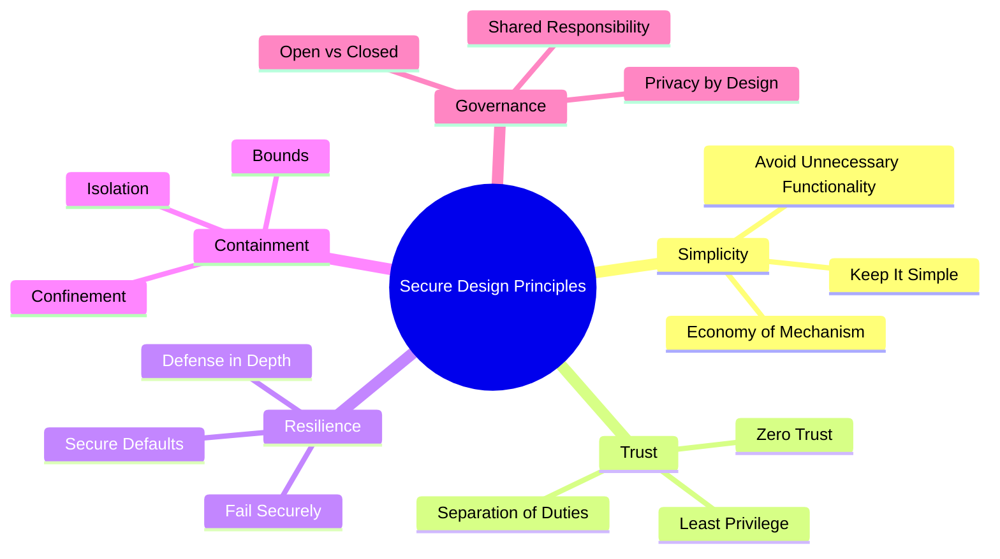
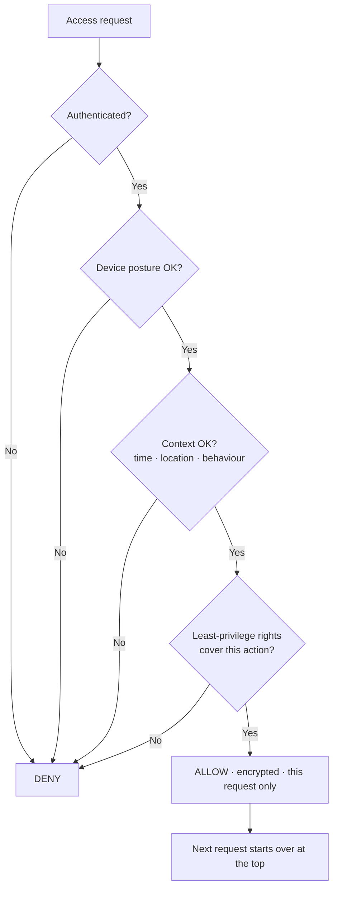
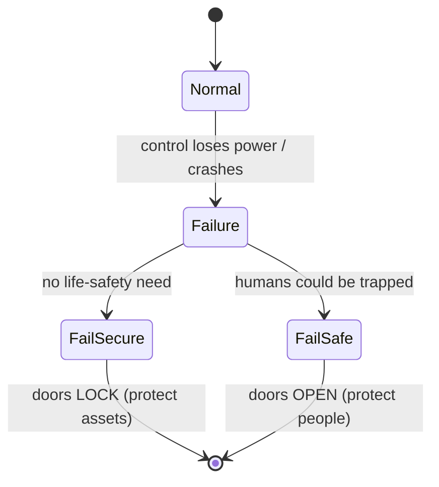

# Chapter 1 — Secure Design Principles (Sub-domain 3.1)

> **Official objective:** *Research, implement and manage engineering processes using secure design principles.*

---

## 1. Beginner Introduction

**What this topic is.** Secure design principles are a small set of timeless rules for building systems that
resist attack *by construction* — not by bolting security on afterwards. They are the "laws of physics" of
security engineering. Think of them as the habits a good architect follows before writing a single line of
code or drawing a single network diagram.

**Why it exists.** Most breaches are not clever zero-days. They are the predictable result of systems that were
too complex, trusted too much by default, failed in an insecure direction, or gave everyone far more access
than they needed. These principles were distilled (originally by Jerome Saltzer and Michael Schroeder in 1975)
precisely because the same mistakes kept recurring.

**Why CISSP includes it.** Domain 3 is about turning *business and risk requirements into technical controls*.
You cannot select or evaluate a control intelligently unless you understand the design philosophy it is
supposed to serve. Every later topic — models, cryptography, physical security — is an *application* of these
principles.

**Why security professionals should understand it.** Because on the job you will be asked "is this design
secure?" long before there is anything to scan or pen-test. The only way to answer at that stage is to check
the design against principles. Principles are also what let you reason about brand-new technology you have
never seen before.

> [!NOTE]
> These are *design-time* controls. Their entire value is that they are cheapest and most effective when applied
> before the system is built. That single idea underpins the whole domain.

---

## 2. Concept Explanation

### Economy of Mechanism

- **Definition:** keep security mechanisms as *small and simple* as possible.
- **Purpose:** a small mechanism has fewer places to hide a bug and can actually be reviewed and tested
  completely.
- **How it works:** you deliberately minimise the code and logic that enforces security, and you isolate it so
  it can be examined on its own.
- **Why it matters:** complexity is the enemy of security. Every branch, option and feature multiplies the
  number of states the system can be in — and any one of them might be exploitable.
- **Real-world usage:** a microservice that does *only* authentication, 300 lines long, audited line by line —
  versus a 200,000-line monolith where auth is tangled through everything.
- **Common misconception:** "more security features = more secure." The opposite is often true; more features =
  more attack surface.

### Avoid Unnecessary Functionality

- **Definition:** remove features you don't need *at design time*, not merely disable them.
- **Why it matters:** a disabled feature still ships in the code. It is one misconfiguration, one toggle, one
  bug away from being live again. Removed code cannot be re-enabled by an attacker.
- **Real-world usage:** stripping unused services, ports, sample apps and debug endpoints out of a server image
  before deployment (this is *hardening*).

### Keep It Simple (KISS)

- **Definition:** structure the system so security-critical functions live in small, isolated, rigorously
  tested components.
- **How it works:** you separate the "must never fail" parts from everything else, so you can pour your review
  effort into the small critical core.

### Open vs Closed Systems

- **Open system:** built on published industry standards (TCP/IP, TLS, SAML). Interoperable, widely understood
  — and widely targeted. Its security must come from *robust implementation* and *defense in depth*.
- **Closed system:** proprietary, undisclosed internals. Harder to integrate; leans partly on *security through
  obscurity*.

### Security Through Obscurity

- **Definition:** relying on the *secrecy of the design* as the protection.
- **Why it matters / misconception:** it is **never** a valid *primary* strategy. It can be a minor extra layer,
  but the instant the secret leaks the protection evaporates. Contrast **Kerckhoffs' principle** (from
  cryptography): a system must remain secure even if everything about it except the key is public.

> [!IMPORTANT]
> The exam's stance is absolute: obscurity may *supplement* real controls but can never *replace* them.

---

## 3. Internal Working

What actually happens when "least privilege" and "fail securely" are enforced on a real access request:

```
User issues a request
        │
        ▼
Application receives it ─────────────► checks: is this action within the user's granted rights?
        │                                        │
        │                              (least privilege: only the minimum rights exist to check against)
        ▼                                        ▼
Operating System / policy engine ────► evaluates the request against the access-control policy
        │
        ▼
CPU enforces the privilege level (Ring 0 vs Ring 3) — hardware refuses a user-mode process
        │                                            direct hardware access
        ▼
Memory manager enforces bounds & isolation — the process can only touch its own address space
        │
        ▼
Security control returns ALLOW or DENY
        │
        ▼
If the control itself FAILS (crash, timeout) ──► fail securely = default DENY
        │
        ▼
Result delivered to the user (or blocked)
```

The key insight: each principle is enforced at a *different layer*, and they compound. Least privilege shrinks
what can be requested; confinement/isolation shrinks what a compromised process can reach; fail-secure decides
the safe default when a layer breaks.

---

## 4. Real-World Example

**Company:** *Meridian Bank*, rolling out a new online-loan platform.

- **Architect (Priya)** applies *economy of mechanism*: the credit-decision engine is a small isolated service,
  not baked into the web app. She applies *avoid unnecessary functionality* by removing the vendor's sample
  admin console from the build entirely.
- **Users** (loan officers) get *least privilege*: an officer can *submit* a loan for approval but cannot also
  *approve* it — that is *separation of duties*, so fraud would require two colluding people.
- **Administrator (Dan)** configures the door controllers and app servers to *fail securely*: if the policy
  engine is unreachable, access is denied, not granted.
- **Attacker (external)** phishes an officer's laptop and gets a foothold. But *Zero Trust* means the stolen
  session is re-verified on every request — and when the attacker pivots from an unrecognised device in another
  country, the request is denied despite valid credentials. *Assume breach* segmentation stops lateral movement.
- **Security team** later audits and finds the design already satisfies principles — so remediation is cheap.
  Had the platform trusted the internal network flatly, the phish would have reached everything.

---

## 5. Step-by-Step Walkthrough — Applying the Principles to a New Design

1. **Start from requirements.** Write down what the system must do *and* the risk/compliance constraints.
2. **Threat model.** Ask "what can go wrong?" using STRIDE (classify), PASTA (simulate against business impact)
   or DREAD (rank). Do this *now*, on paper, while changes are free.
3. **Minimise.** Cut every feature, port and service not strictly required (economy of mechanism + avoid
   unnecessary functionality).
4. **Isolate the critical core.** Put security-critical logic in small, separately testable components (KISS).
5. **Assign least privilege.** Give each identity the minimum rights, ideally Just-In-Time.
6. **Layer controls.** Add administrative + technical + physical controls so no single failure reaches the asset
   (defense in depth).
7. **Choose safe defaults.** Default-deny, features off, no default passwords (secure defaults).
8. **Define failure behaviour.** Decide fail-secure vs fail-safe for every control (security vs life safety).
9. **Separate duties.** Split any single task powerful enough to enable fraud.
10. **Adopt Zero Trust.** Authenticate, authorize and encrypt *every* request against identity + device +
    context; assume breach and segment.
11. **Bake in privacy.** Make privacy the default setting, not an opt-in (privacy by design).
12. **Document the shared-responsibility split** for anything cloud/outsourced — and remember accountability
    stays with you.

---

## 6. Visual Learning

### The principles, grouped



### Zero Trust decision on every request



### Fail-secure vs fail-safe decision



> [!NOTE]
> **Where an animated infographic helps:** the confinement chain. Frame 1 — a process sits in a box labelled
> *bounds* (memory limits). Frame 2 — arrows to neighbouring processes turn red and are blocked (*confinement*).
> Frame 3 — a wall (hardware/OS) slams down enforcing it (*isolation*). Frame 4 — one box turns "compromised"
> red but the wall holds, neighbours stay green (*payoff*).

---

## 7. Memory Tricks

- **Analogy for economy of mechanism:** a bank vault with one thick door is safer than a maze with fifty thin
  doors — fewer things to pick.
- **Analogy for least privilege:** give a house-guest a key to the guest room, not the master keyring.
- **Mnemonic for Zero Trust pillars:** **"VLA"** — **V**erify always, **L**east privilege, **A**ssume breach.
- **Confinement chain:** **"Bounds → Confine → Isolate"** = *set the limit → state the rule → enforce the wall*.
- **Fail-state hook:** **"People open, property locks."** If life is at stake, fail *safe* (open); otherwise
  fail *secure* (locked).
- **Obscurity:** *"A secret you can't change isn't a control — it's a countdown."*

---

## 8. Common Exam Traps

- **Obscurity as a "valid" answer.** If an option says security comes from *hiding the design*, it is wrong as a
  primary strategy — every time.
- **Disabled vs removed.** "We disabled the feature" is a weaker answer than "we removed it in design."
- **Fail-secure vs fail-safe reversed.** Read for *life safety*. No people at risk → fail secure. People could
  be trapped → fail safe/open. Do not let "secure sounds better" fool you.
- **Least privilege vs need-to-know.** Least privilege = minimum *rights/actions*; need-to-know = minimum *data
  access*. They pair but are not identical.
- **Zero Trust "one strong login."** Zero Trust re-checks *every request*; a strong morning login does not buy
  afternoon trust.
- **Separation of duties vs dual control vs split knowledge.** SoD splits *a process across roles*; dual control
  needs *two people to perform one action*; split knowledge means *no one knows the whole secret*.

---

## 9. Comparison Table

| Principle | One-line meaning | Classic exam cue |
|-----------|------------------|------------------|
| Economy of mechanism | Keep it small & simple | "complex system, hard to audit" |
| Avoid unnecessary functionality | Remove, don't disable | "feature was disabled but present" |
| Least privilege | Minimum rights, minimum time | "user had more access than the job needed" |
| Separation of duties | Split a task so fraud needs collusion | "one person could both create and approve" |
| Defense in depth | Layered, no single point | "one control failed and it was game over" |
| Fail securely | Default deny on failure | "system crashed — what should happen?" |
| Secure defaults | Ships locked down | "default password / feature left on" |
| Zero Trust | Verify every request | "trusted once on the VPN, reached everything" |
| Privacy by design | Privacy is the default | "privacy was opt-in / added later" |
| Obscurity | Never primary | "secure because nobody knows how it works" |

### Open vs Closed systems

| | Open system | Closed system |
|---|---|---|
| Basis | Published standards | Proprietary internals |
| Interoperability | High | Low |
| Attack exposure | Widely targeted | Narrower, but obscurity-reliant |
| Security must come from | Implementation + defense in depth | Should still not rely on obscurity |

---

## 10. Interview Perspective

- **Security Engineer:** "Walk me through hardening a server image" → economy of mechanism + avoid unnecessary
  functionality + secure defaults.
- **Security Architect:** "How would you design access for a new app?" → least privilege + SoD + Zero Trust +
  defense in depth, justified against a threat model.
- **GRC Consultant:** maps these principles to control frameworks (NIST 800-53 SA/AC families, ISO 27001 Annex
  A) and to privacy-by-design obligations under GDPR.
- **SOC Analyst:** sees the *failure* of these principles daily — flat networks (no segmentation), over-privileged
  service accounts — and cites them in incident post-mortems.
- **Cloud Engineer:** lives the shared-responsibility model and Zero Trust (identity-aware proxies, per-request
  authorization, least-privilege IAM roles).
- **Auditor:** tests whether least privilege and SoD are *actually enforced*, not just documented.

---

## 11. Standards & References

- **ISC² CISSP CBK** — Domain 3, secure design principles.
- **Saltzer & Schroeder (1975)** — *The Protection of Information in Computer Systems* (the original eight
  principles).
- **NIST SP 800-160 Vol. 1 Rev. 1** — Systems Security Engineering.
- **NIST SP 800-207** — Zero Trust Architecture.
- **CISA** — Zero Trust Maturity Model.
- **OWASP** — Security by Design Principles.
- **GDPR Article 25** — Data protection by design and by default.

---

## 12. Key Takeaways

- Security is cheapest and strongest when designed in, not bolted on.
- Simplicity is a security control: economy of mechanism + remove (don't disable) unused features.
- Obscurity is never a primary defence; assume the design is public (Kerckhoffs).
- Least privilege + separation of duties limit both mistakes and fraud.
- Defense in depth means no single failure reaches the asset.
- Fail secure by default; fail safe only when human life requires it.
- Zero Trust: verify identity + device + context on *every* request; assume breach; segment.
- Bounds set the limit, confinement restricts, isolation enforces — a compromised process stays contained.
- Privacy by design = privacy as the default; shared responsibility never transfers accountability.
