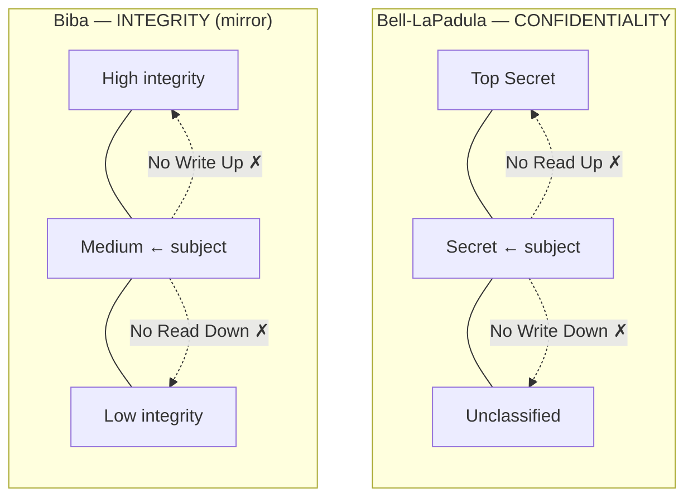
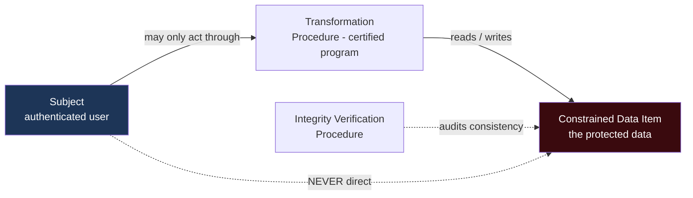
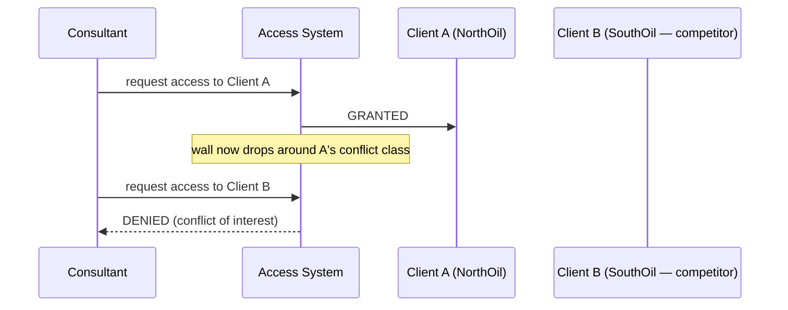

# Chapter 2 — Security Models (Sub-domain 3.2)

> **Official objective:** *Understand the fundamental concepts of security models.*

---

## 1. Beginner Introduction

**What this topic is.** A security *model* is a precise, often mathematical, description of how a system should
behave so that a security *policy* is actually enforced. A policy is a goal in English ("secrets must not
leak"); a model turns that goal into exact, checkable rules ("no subject may write to a lower level").

**Why it exists.** English policies are ambiguous, and ambiguity is where attackers live. In the 1970s the US
military needed to *prove* that a computer processing Top Secret and Confidential data at the same time could
not leak. You cannot prove a vague sentence. You can prove a formal model. So models were born to make security
*provable*.

**Why CISSP includes it.** Because the exam wants you to reason about *why* a control design is safe, and to
recognise which classic model matches a given goal. Models are also the theoretical parents of real mechanisms
you meet later (mandatory access control, the reference monitor, multilevel databases).

**Why security professionals should understand it.** Even if you never build one, you inherit them: MAC systems
(SELinux, classified networks) are Bell-LaPadula in production; commercial integrity controls echo Clark-Wilson;
conflict-of-interest walls in consulting and finance are Brewer-Nash.

> [!IMPORTANT]
> The single most useful exam habit: **identify the model's GOAL first** (confidentiality? integrity? conflict
> of interest?). The rules always follow from the goal.

---

## 2. Concept Explanation

### The four model *families* (learn these before the named models)

- **State machine model.** *Definition:* the system is described as a set of states and transitions; it is
  secure if it *starts* in a secure state and *every* transition leads to another secure state. *Why it
  matters:* it is the umbrella idea behind most formal models — "secure at every step."
- **Information flow model.** *Definition:* controls *where* data is allowed to move between levels/objects,
  blocking flows that break policy. Both Bell-LaPadula and Biba are information-flow models.
- **Noninterference model.** *Definition:* actions by high-level subjects must be *completely invisible* to
  low-level subjects — a low user cannot even *infer* that something happened above them. *Why it matters:* this
  is the theory behind stopping covert channels and inference.
- **Lattice-based model.** *Definition:* classification levels and compartments are arranged in a mathematical
  lattice; every subject-object pair has a defined upper and lower bound that fixes what access is possible.

### The named models

- **Bell-LaPadula (BLP)** — goal: **confidentiality**. Rules: *Simple Security Property* = **No Read Up**;
  *Star (★) Property* = **No Write Down**; *Strong Star* = read/write only at your exact level. First
  mathematically proven model; military heritage.
- **Biba** — goal: **integrity** (the mirror of BLP). Rules: *Simple Integrity* = **No Read Down**; *Star
  Integrity* = **No Write Up**; *Invocation Property* = cannot invoke a higher-integrity subject. *Weaknesses:*
  integrity only (no confidentiality/availability), no access-control administration, does not stop covert
  channels, no way to change classification levels.
- **Clark-Wilson** — goal: **commercial integrity**. Subjects never touch data directly; every change goes
  through a certified program (the *access triple* Subject → Program → Object). Enforces well-formed
  transactions + separation of duties; an Integrity Verification Procedure audits consistency.
- **Brewer-Nash (Chinese Wall)** — goal: prevent **conflicts of interest**. Access rights change dynamically
  based on your history: touch Client A's data and a wall drops between you and A's competitors.
- **Graham-Denning** — defines **eight rules** for securely creating/deleting subjects and objects and
  granting/transferring/deleting rights.
- **Harrison-Ruzzo-Ullman (HRU)** — extends Graham-Denning to ask whether a right can ever *leak* to an
  unauthorised subject: the **safety problem**, undecidable in general.
- **Lipner** — combines BLP + Biba when you need confidentiality *and* integrity together.

> [!NOTE]
> **Common misconception:** "Biba is just BLP backwards, so it also protects secrets." No — Biba protects
> *integrity only*. Reversing the rules reverses the *goal*, not adds one.

---

## 3. Internal Working

How BLP actually stops a leak, step by step, inside a multilevel system:

```
Subject (cleared SECRET) requests an operation
        │
        ▼
Reference monitor intercepts EVERY access (it cannot be bypassed)
        │
        ├─ READ request on a TOP SECRET object
        │        ▼
        │   Simple Security Property check: subject level ≥ object level?
        │        SECRET ≥ TOP SECRET? NO  ──►  DENY (No Read Up)
        │
        └─ WRITE request to an UNCLASSIFIED object
                 ▼
            Star Property check: subject level ≤ object level?
                 SECRET ≤ UNCLASSIFIED? NO  ──►  DENY (No Write Down)
        │
        ▼
Only flows that preserve confidentiality are allowed → the state stays secure
```

Biba runs the *same machinery* with the comparisons flipped: read is allowed only *up or equal* in integrity,
write only *down or equal* — so dirty data can never flow into clean records.

---

## 4. Real-World Example

**Company:** *Aegis Defense Systems*, running a classified analytics platform, plus a commercial billing system.

- **Classified side (BLP):** an analyst (Ravi) cleared SECRET queries the platform. He can read Confidential and
  Secret reports (read down/equal) but the system refuses to open a Top Secret file (**No Read Up**). When he
  tries to paste Secret findings into an Unclassified summary, the write is blocked (**No Write Down**) — the
  control literally prevents the leak he didn't realise he was creating.
- **Billing side (Clark-Wilson):** clerks never edit invoice rows directly. They run *certified transaction
  programs*; one clerk raises a payment, a *different* one approves it (separation of duties). Fraud now needs
  two people to collude.
- **Consulting arm (Brewer-Nash):** a consultant advises *NorthOil*. The instant she opens NorthOil's data, the
  system walls her off from *SouthOil* (a direct competitor in the same conflict class) — permanently, based on
  her own access history.
- **Attacker:** a low-integrity web form tries to write straight into the master ledger. **Biba's No Write Up**
  refuses it — untrusted input cannot corrupt trusted records.

---

## 5. Step-by-Step Walkthrough — Picking the Right Model in an Exam Scenario

1. **Read for the GOAL.** Is the scenario worried about *leaks* (confidentiality), *corruption/trust*
   (integrity), or *conflict of interest*?
2. **Leak → Bell-LaPadula.** Then recall the two rules: No Read Up, No Write Down.
3. **Corruption/trust → Biba.** Rules flip: No Read Down, No Write Up.
4. **"Go through a program, never touch data directly" + SoD → Clark-Wilson.**
5. **"Blocked from a competitor after touching a client" → Brewer-Nash.**
6. **"Rules for creating subjects/objects & rights" → Graham-Denning; "can a right leak?" → HRU.**
7. **Need both confidentiality and integrity → Lipner.**
8. **If asked for the *family*:** "secure in every state" = state machine; "controls data movement" =
   information flow; "high actions invisible to low" = noninterference; "levels + compartments" = lattice.

---

## 6. Visual Learning

### BLP vs Biba — the mirror



### Clark-Wilson access triple



### Brewer-Nash dynamic wall



---

## 7. Memory Tricks

- **BLP hook:** *"No Read Up, No Write Down"* → **"Nurse Ratched Never Writes Down"** — or simply **"read down,
  write up"** is what you *can* do for confidentiality.
- **Biba is the mirror:** whatever BLP allows, Biba forbids the direction. Integrity = "don't take dirt in
  (no read down), don't push dirt up (no write up)."
- **Confidentiality vs integrity:** **"BLP guards the Lips (secrets); Biba guards the Books (records)."**
- **Clark-Wilson:** **"You can't touch the money — you fill in a form."** (Subject → Program → Object.)
- **Brewer-Nash:** **"Chinese Wall"** — once you're on one side, you can never see the other.
- **HRU:** **H**as this **R**ight **U**nexpectedly leaked? (the safety problem).

---

## 8. Common Exam Traps

- **Naming the rule but missing the goal.** They'll describe a *leak* and hope you pick Biba because "integrity
  sounds serious." Goal first: leak = BLP.
- **Simple vs Star.** *Simple* properties are about **reading**; *Star (★)* properties are about **writing** —
  in *both* BLP and Biba. Mixing these up is the classic error.
- **"Strong Star."** Means read/write only at your *own* level — used when even reading down is too risky.
- **Biba's weaknesses.** They love asking what Biba does *not* do: no confidentiality, no availability, no
  covert-channel prevention, no classification changes.
- **Clark-Wilson vs Biba.** Both integrity — but Clark-Wilson is the *commercial, transaction + SoD* one; Biba
  is the *lattice/level* one.
- **Model vs mechanism.** A model is the theory; MAC, the reference monitor, and multilevel databases are the
  mechanisms that implement it.

---

## 9. Comparison Table

| Model | Goal | Core rule(s) | Signature exam cue |
|-------|------|--------------|--------------------|
| Bell-LaPadula | Confidentiality | No Read Up, No Write Down | military, "can't leak Secret to Unclassified" |
| Biba | Integrity | No Read Down, No Write Up | "untrusted input must not corrupt records" |
| Clark-Wilson | Commercial integrity | Subject→Program→Object, SoD | "never edit data directly / two-person" |
| Brewer-Nash | No conflict of interest | Dynamic wall by history | "blocked from a competitor" |
| Graham-Denning | Manage rights safely | 8 protection rules | "create/delete subject, grant rights" |
| HRU | Rights-leak safety | Extends Graham-Denning | "can a right ever leak?" |
| Lipner | Confidentiality + integrity | BLP + Biba combined | "need both at once" |

| Family | It proves / controls… | Cue |
|--------|----------------------|-----|
| State machine | Secure in every state & transition | "starts secure, stays secure" |
| Information flow | Where data may move | "block flows between levels" |
| Noninterference | High actions invisible to low | "low user infers high activity" |
| Lattice | Bounds of access via levels+labels | "compartments and clearances" |

---

## 10. Interview Perspective

- **Security Architect:** justifies a MAC design ("this classified enclave enforces Bell-LaPadula via labelled
  security") or a commercial integrity design ("payments follow Clark-Wilson: certified TPs + SoD").
- **GRC Consultant:** maps Brewer-Nash to real *conflict-of-interest* controls in audit firms, law firms and
  investment banks (information barriers).
- **Security Engineer:** implements the models as SELinux/AppArmor policies, database views, and separation of
  duties in workflow tooling.
- **Auditor:** verifies that "no single person can complete a sensitive transaction" (Clark-Wilson SoD) is
  actually enforced in the ERP, not just written in a policy.
- **SOC Analyst:** recognises a *noninterference/inference* failure when low-privilege telemetry reveals
  high-privilege activity.

---

## 11. Standards & References

- **ISC² CISSP CBK** — Domain 3, security models.
- **Bell & LaPadula (1973-76)** — the confidentiality model (MITRE technical reports).
- **Biba (1977)** — *Integrity Considerations for Secure Computer Systems*.
- **Clark & Wilson (1987)** — *A Comparison of Commercial and Military Computer Security Policies*.
- **Brewer & Nash (1989)** — *The Chinese Wall Security Policy*.
- **NIST SP 800-192** — Verification and Test Methods for Access Control Policies/Models.
- **DoD 5200.28-STD (TCSEC / Orange Book)** — historical origin of evaluated, model-based assurance.

---

## 12. Key Takeaways

- Identify the **goal** first; the rules follow.
- **BLP = confidentiality** (No Read Up, No Write Down); **Biba = integrity** (No Read Down, No Write Up) — mirror
  images.
- *Simple* properties govern **reading**; *Star* properties govern **writing**.
- **Clark-Wilson** = commercial integrity via the access triple + separation of duties.
- **Brewer-Nash** = dynamic conflict-of-interest wall driven by access history.
- **Graham-Denning** = 8 rules for managing rights; **HRU** = can a right leak (safety problem).
- **Lipner** = BLP + Biba when you need both.
- Families: state machine (secure at every step), information flow (where data moves), noninterference (high
  invisible to low), lattice (levels + compartments).
