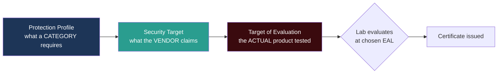
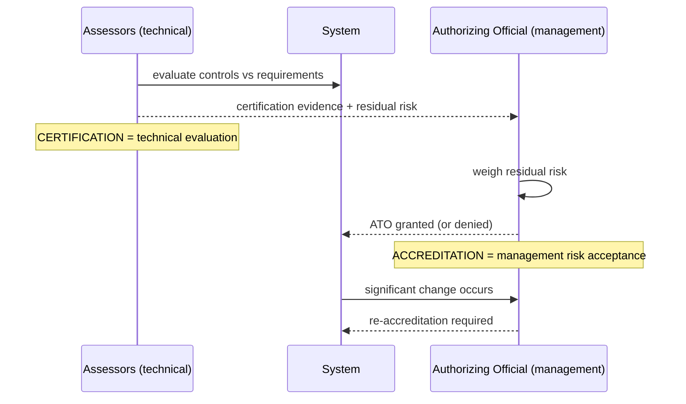

# Chapter 3 — Evaluation Criteria & System Authorization (Sub-domain 3.3)

> **Official objective:** *Select controls based upon systems security requirements.*

---

## 1. Beginner Introduction

**What this topic is.** A way to answer one hard question: *"How do I know a product is actually as secure as
the vendor says?"* The answer is **independent evaluation against a published standard**, followed by a formal
management decision to accept whatever risk remains.

**Why it exists.** Vendors always claim their product is secure. Buyers — especially governments — needed a
neutral, repeatable yardstick so "secure" meant the same thing across products and countries. Otherwise every
procurement is a guessing game.

**Why CISSP includes it.** Selecting controls is a core architect responsibility. The exam tests whether you
know the vocabulary (PP, ST, TOE, EAL) and, crucially, the difference between *evaluating* a system
(certification) and *approving it to run* (accreditation).

**Why security professionals should understand it.** Because "who signs off the risk?" is a real, career-defining
question. Engineers evaluate; *management* accepts risk. Confusing the two is how people end up personally
holding a bag they were never authorised to hold.

---

## 2. Concept Explanation

### The three generations of evaluation criteria

- **TCSEC (the "Orange Book").** US Department of Defense, 1983. Focused on **confidentiality only**. Ratings
  from **D** (minimal) up through C, B, to **A1** (verified). Historic, now retired, but the exam still names it.
- **ITSEC.** European, 1990s. Broadened to **confidentiality, integrity and availability**, and importantly
  *separated* the assessment of **Functionality** (what it does) from **Effectiveness/Assurance** (how well and
  how confidently).
- **Common Criteria (ISO/IEC 15408).** The global standard today, which superseded both. Its vocabulary is what
  the exam tests.

### Common Criteria vocabulary

- **Protection Profile (PP)** — what a *category* of product is required to do. *"What is required."* Example: a
  PP for firewalls.
- **Security Target (ST)** — the *specific vendor's claim* about their product. *"What is promised."*
- **Target of Evaluation (TOE)** — the *actual product* being tested. *"What is evaluated."*
- **Evaluation Assurance Level (EAL)** — how *rigorously* the claims were checked, EAL1–EAL7.

### The EAL ladder

| EAL | Meaning |
|-----|---------|
| EAL1 | Functionally tested |
| EAL2 | Structurally tested |
| EAL3 | Methodically tested and checked |
| **EAL4** | **Methodically designed, tested and reviewed — the commercial ceiling** |
| EAL5 | Semiformally designed and tested |
| EAL6 | Semiformally verified design and tested |
| EAL7 | Formally verified design and tested (mathematical proof) |

> [!WARNING]
> A higher EAL means the claims were **evaluated more rigorously** — *not* that the product has more security
> features. A phone at EAL2 might be "more secure" in features than an EAL6 gadget; EAL only measures assurance
> of the evaluation.

### Certification vs Accreditation

- **Certification** — the comprehensive **technical evaluation** of a system's controls against requirements.
  Done by assessors; produces evidence.
- **Accreditation** — the formal **management decision** to accept the residual risk and authorise operation,
  based on that evidence.
- **Authorization to Operate (ATO)** — in US federal practice (NIST RMF, SP 800-37) this *is* the accreditation
  decision, granted by the **Authorizing Official (AO)**. The four decisions: Authorization to Operate, Common
  Control Authorization, Authorization to Use, Denial of Authorization.

> [!IMPORTANT]
> **Certify first, then accredit.** Technical people certify (evaluate); leadership accredits (accepts risk and
> says "go live"). Re-accredit after significant change.

---

## 3. Internal Working

How a Common Criteria evaluation flows behind the scenes:

```
Government / industry defines the need
        │
        ▼
Protection Profile (PP) written  ──►  "what firewalls in this class MUST do"
        │
        ▼
Vendor writes a Security Target (ST) ──► "here is what OUR firewall claims, and to which PP"
        │
        ▼
The actual product = Target of Evaluation (TOE)
        │
        ▼
Accredited testing lab evaluates the TOE against the ST at a chosen EAL
        │
        ▼
Certificate issued (product + ST + EAL)  ← this is CERTIFICATION (technical)
        │
        ▼
Buyer's Authorizing Official reviews evidence + residual risk
        │
        ▼
ATO granted / denied  ← this is ACCREDITATION (management risk acceptance)
        │
        ▼
System operates — re-evaluated on significant change
```

---

## 4. Real-World Example

**Company:** *Helios Federal Cloud*, selling a SaaS platform to a US government agency.

- **Vendor** writes a **Security Target** describing exactly what their platform protects and maps it to the
  relevant **Protection Profile** for cloud services.
- An accredited **lab** takes the running product (the **TOE**) and tests it to **EAL4** — methodically
  designed, tested and reviewed, the commercial norm.
- The lab issues a **certificate**: that is **certification** — a purely technical statement of "we evaluated
  these claims and they hold."
- The agency's **Authorizing Official** (a senior official, not an engineer) reads the certification evidence
  plus a residual-risk report and issues an **ATO** — that is **accreditation**, the management decision to run
  the system. She could also issue a *Denial of Authorization* if the residual risk is unacceptable.
- Two years later Helios ships a major architecture change → the agency requires **re-accreditation**.
- **Attacker angle:** a competitor markets an "EAL7 gadget." The security team explains to procurement that
  EAL7 means *more rigorous evaluation*, not more features — and the Helios EAL4 SaaS is the better fit for the
  actual requirement.

---

## 5. Step-by-Step Walkthrough — From Requirement to Running System

1. **Define requirements** for the class of product (formalised as a Protection Profile).
2. **Vendor responds** with a Security Target mapping their product to that PP.
3. **Identify the TOE** — the exact product, version and configuration to be tested.
4. **Choose an EAL** appropriate to the risk (EAL4 for most commercial; higher only when justified).
5. **Independent lab evaluates** the TOE against the ST at that EAL.
6. **Certification** issued — the technical result.
7. **Authorizing Official reviews** certification + residual risk.
8. **Accreditation decision (ATO)** — accept risk and authorise, or deny.
9. **Operate** under continuous monitoring.
10. **Re-certify / re-accredit** on significant change.

---

## 6. Visual Learning

### PP → ST → TOE relationship



### Certification vs Accreditation flow



---

## 7. Memory Tricks

- **PP / ST / TOE:** **"Profile = the job description, Target = the résumé, TOE = the actual candidate."**
- Or: **P**P = **P**olicy/required, **S**T = **S**ales claim, **TOE** = **T**he **O**bject **E**valuated.
- **EAL4:** *"Four is for the Field"* — EAL4 is the real-world commercial ceiling.
- **Certify vs Accredit:** **"Certify = Check (technical); Accredit = Accept (management)."** Alphabetical too:
  **C** before **A**? No — remember **certify first, then accredit** (you evaluate before you approve).
- **ATO:** *"Authorising Official signs the ATO"* — both start with A, and both are *management*.

---

## 8. Common Exam Traps

- **Higher EAL = more secure.** FALSE. Higher EAL = more rigorous *evaluation*, not more features.
- **Who accepts risk?** Always **management / the Authorizing Official** — never the assessor or engineer.
- **PP vs ST.** PP = what a *category* requires (generic); ST = what *this vendor* claims (specific). They love
  swapping these.
- **Certification vs accreditation order.** Certify (technical) *then* accredit (management). Accreditation
  depends on certification evidence.
- **TCSEC scope.** Orange Book = **confidentiality only**; ITSEC added integrity + availability; Common Criteria
  is the modern global standard.
- **"Re-run when nothing changed?"** Re-accreditation is triggered by *significant change*, not by the calendar
  alone (though periodic review exists too).

---

## 9. Comparison Table

| | Certification | Accreditation |
|---|---|---|
| Nature | Technical evaluation | Management decision |
| Who | Assessors / engineers | Authorizing Official (senior mgmt) |
| Output | Evidence the controls work | ATO / risk acceptance |
| Question answered | "Do the controls meet requirements?" | "Do we accept the residual risk and run it?" |
| Order | First | Second (depends on certification) |

| Criteria | Era / origin | Scope | Key terms |
|----------|-------------|-------|-----------|
| TCSEC (Orange Book) | 1983, US DoD | Confidentiality only | Ratings D → A1 |
| ITSEC | 1990s, Europe | C + I + A | Functionality vs Effectiveness |
| Common Criteria (ISO 15408) | 1999+, global | Flexible via PP/ST | PP, ST, TOE, EAL1–7 |

---

## 10. Interview Perspective

- **Security Architect:** chooses products partly on evaluation status ("we need a Common Criteria-certified,
  EAL4 firewall for this enclave") and writes the Security Target inputs.
- **GRC Consultant / Auditor:** lives the certification-and-accreditation (now *Assessment and Authorization*)
  process under NIST RMF; ensures the AO signs the ATO and that re-authorization triggers on change.
- **Security Engineer:** produces the technical evidence (test results, configuration baselines) that
  certification consumes.
- **Cloud Engineer:** works with FedRAMP (which is Common-Criteria-adjacent authorization for cloud) — the
  agency ATO/P-ATO is the accreditation.
- **Interview soundbite:** *"Certification is the technical evaluation; accreditation is management's formal
  acceptance of residual risk. EAL measures assurance of the evaluation, not the number of features."*

---

## 11. Standards & References

- **ISC² CISSP CBK** — Domain 3, evaluation criteria and authorization.
- **ISO/IEC 15408** — Common Criteria for IT Security Evaluation.
- **Common Criteria Portal** — Protection Profiles and certified products.
- **NIST SP 800-37 Rev. 2** — Risk Management Framework (Assessment & Authorization, ATO).
- **DoD 5200.28-STD** — TCSEC (Orange Book), historical.
- **ITSEC (1991)** — European evaluation criteria, historical.
- **FedRAMP** — US government cloud authorization program.

---

## 12. Key Takeaways

- Evaluation criteria give a neutral yardstick for "how secure is this really?"
- Three generations: **TCSEC** (confidentiality only) → **ITSEC** (added I + A) → **Common Criteria** (global,
  today).
- **PP** = what a category requires; **ST** = what the vendor claims; **TOE** = the product tested.
- **EAL1–7** measure how rigorously the claims were evaluated — **EAL4 is the commercial ceiling**, EAL7 is
  formal proof.
- Higher EAL ≠ more features; it = more assurance.
- **Certification** (technical) comes first; **accreditation** (management risk acceptance) comes second.
- The **Authorizing Official** grants the **ATO**; re-accredit on significant change.
