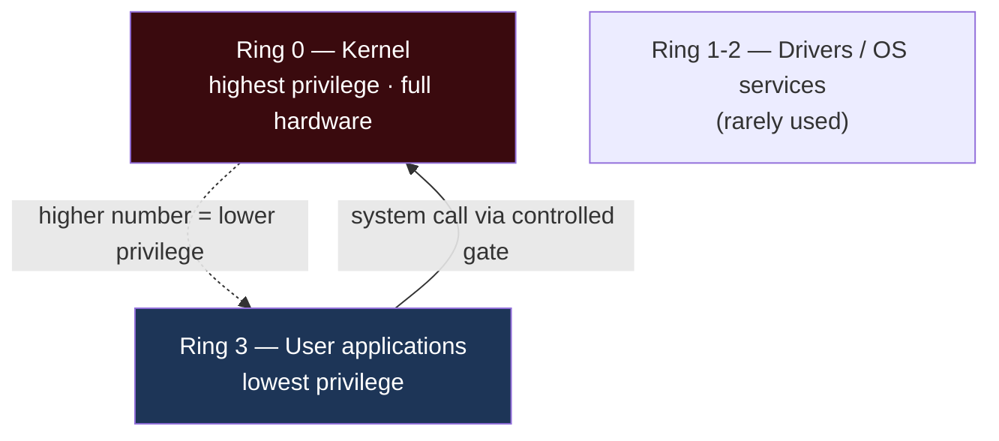
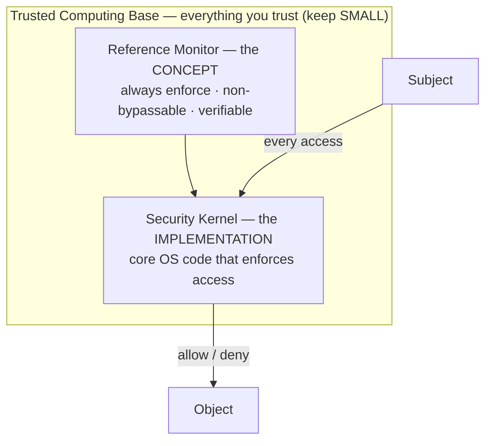
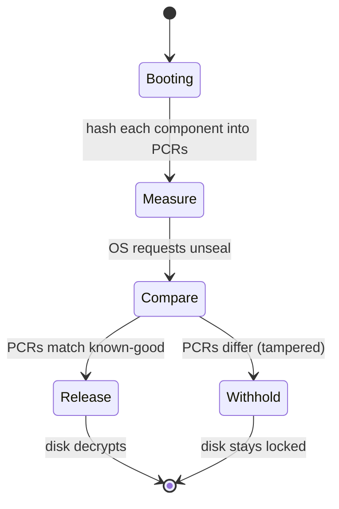

# Chapter 4 — Security Capabilities of Information Systems (Sub-domain 3.4)

> **Official objective:** *Understand security capabilities of information systems.*

---

## 1. Beginner Introduction

**What this topic is.** The *hardware and operating-system machinery* that makes security enforcement physically
possible. Policies and models are ideas; this chapter is the silicon and kernel code that actually stops one
program reading another's memory, or refuses a user app direct access to the disk controller.

**Why it exists.** Software alone can be tricked. If the *hardware* enforces a boundary, an attacker who
subverts software still hits a wall. So CPUs, memory managers and dedicated security chips provide roots of
trust that software can lean on.

**Why CISSP includes it.** The exam expects an architect to know *where* enforcement lives: which CPU ring runs
the kernel, what the Trusted Computing Base is, and when to reach for a TPM versus an HSM. These are the
building blocks the rest of the domain assumes.

**Why security professionals should understand it.** Because real controls — full-disk encryption, secure boot,
key protection, process isolation — are all specific expressions of these capabilities. "Where is the key
stored and what enforces that?" is a question you will answer constantly.

---

## 2. Concept Explanation

### CPU anatomy

- **ALU (Arithmetic Logic Unit).** Performs the actual mathematical and logical operations. *If a question asks
  "what adds two numbers?" — the ALU.*
- **Control Unit.** *Directs* instructions but executes nothing itself — the traffic cop, not the worker.
- **Registers.** Tiny, extremely fast internal memory holding data the CPU is working on right now.

### Execution models (easy to confuse)

- **Multitasking.** One CPU switches between tasks fast enough to *fake* parallelism (context switching).
- **Multiprocessing.** *True* parallel execution across multiple CPUs/cores.
- **Multithreading.** Multiple lightweight threads inside one process, sharing its memory (low overhead).

### Protection rings

- Concentric privilege levels. **Ring 0 = kernel** (full hardware access). **Ring 3 = user applications**
  (least privilege). Rings 1–2 exist for drivers/OS services but are rarely used today.
- **Higher ring number = lower privilege.** This maps to the CPU's **supervisor vs problem** states and the
  OS's **kernel vs user** modes.

### Memory protection

- **Process isolation.** Each process gets its own address space; it cannot read or corrupt another's memory.
- **Hardware segmentation.** Physical-hardware enforcement of boundaries — stronger than OS logic alone,
  because hardware enforces what software cannot guarantee.
- **ASLR (Address Space Layout Randomization).** Randomises where the stack, heap and libraries load at each
  boot, so exploits cannot rely on fixed addresses.
- **Virtual memory (paging/swap).** RAM overflow spills to disk — meaning *secrets can persist in the swap
  file* and must be protected.
- **Data hiding.** Each layer exposes only what the layer above needs.

### TCB, Reference Monitor, Security Kernel

- **Trusted Computing Base (TCB).** *All* hardware, software and firmware critical to security, bounded by the
  **security perimeter**. Compromise any TCB component and the whole system is at risk → **keep the TCB small**.
- **Reference Monitor.** The abstract concept: *every* access by *every* subject to *every* object must be
  checked; the check can *never* be bypassed; the mechanism must be small enough to *verify*.
- **Security Kernel.** The concrete implementation of the reference monitor — the core OS code, inside the TCB,
  that actually makes and enforces access decisions.

> One-line hierarchy: **TCB = what you trust; Reference Monitor = what must be enforced; Security Kernel = how
> it is enforced.**

### Hardware roots of trust

- **TPM (Trusted Platform Module).** A cryptographic coprocessor **chip on the motherboard**, per-device.
  Functions: **Attestation** (prove system integrity to a third party via boot-chain hashes), **Binding** (tie
  data to *this* device), **Sealing** (release a key only when the hardware is in a known-good state — how
  BitLocker works).
- **HSM (Hardware Security Module).** A dedicated, tamper-responsive **network appliance** for high-volume
  crypto and centralised key management; keys can be generated, used and destroyed inside its boundary and never
  exported. CA roots and payment keys live here. Validated to **FIPS 140-3**.

---

## 3. Internal Working

What happens when a user app tries something privileged — say, writing directly to a disk sector:

```
User application (Ring 3) issues a privileged instruction
        │
        ▼
CPU checks current privilege level ── Ring 3 cannot execute Ring 0 instructions
        │                                    │
        │                              FAULT raised
        ▼                                    ▼
Control Unit routes to the OS trap handler (transition Ring 3 → Ring 0 via a controlled gate)
        │
        ▼
Security Kernel (reference monitor implementation) checks the request against policy
        │
        ▼
Memory manager confirms the target is within the process's bounds (isolation)
        │
        ▼
ALU/registers carry out the permitted work in supervisor state
        │
        ▼
Result returned; CPU drops back to Ring 3
```

And a TPM *sealing* operation at boot:

```
Power on ──► firmware measures each boot component, extending hashes into TPM PCRs
        │
        ▼
OS asks TPM to UNSEAL the disk-encryption key
        │
        ▼
TPM compares current PCR values to the known-good values the key was sealed to
        │
        ├─ match  ──► key released ──► disk decrypts ──► boot continues
        └─ mismatch (tampered) ──► key withheld ──► disk stays locked
```

---

## 4. Real-World Example

**Company:** *Northwind Logistics*, hardening a fleet of laptops and a payment back-end.

- **Laptops (TPM):** IT enables BitLocker. The disk key is **sealed** to the TPM against the measured boot
  state. When an attacker steals a laptop and tries to boot a tampered OS to bypass login, the **PCR values
  don't match**, the TPM refuses to release the key, and the disk stays encrypted. *Attestation* also lets the
  MDM verify each laptop booted a known-good image before granting VPN access.
- **Payment back-end (HSM):** the card-processing keys live inside a **FIPS 140-3 HSM**. Even the database
  admin cannot export them; the application asks the HSM to *perform* crypto operations, and keys never leave
  the appliance. This satisfies PCI DSS key-management requirements.
- **Servers (rings + isolation):** a compromised web-app process (Ring 3) tries to read another tenant's
  memory. **Process isolation** and **hardware segmentation** block it; **ASLR** already made its
  buffer-overflow exploit unreliable because library addresses were randomised at boot.
- **Security team** documents that the crypto modules, kernel and these chips form the **TCB** — and pushes
  back when a vendor wants to add a bulky agent into the trusted core (that would *grow the TCB*).

---

## 5. Step-by-Step Walkthrough — Deciding TPM vs HSM

1. **Ask: how many keys, how often?** A few per-device secrets → TPM territory. Millions of operations across
   the network → HSM territory.
2. **Ask: bound to one machine, or shared service?** Per-device (secure boot, disk key) → TPM. Centralised key
   management for many apps → HSM.
3. **Ask: form factor.** Motherboard chip → TPM. Standalone/network appliance (or cloud KMS backed by one) →
   HSM.
4. **Ask: compliance driver.** CA root or payment keys → HSM (FIPS 140-3). Endpoint integrity → TPM.
5. **Pick and justify** against those four axes.

---

## 6. Visual Learning

### Protection rings



### TCB / Reference Monitor / Security Kernel



### TPM sealing decision



---

## 7. Memory Tricks

- **Ring rule:** **"Big number, small power."** Ring 0 = king; Ring 3 = peasant.
- **ALU vs Control Unit:** **"ALU is the Athlete (does the work); Control Unit is the Coach (only directs)."**
- **Multitasking vs multiprocessing:** *"Multitasking = one juggler; multiprocessing = many jugglers."* The
  giveaway is "single-core" → multitasking.
- **TPM functions — "ABS":** **A**ttestation (prove to others), **B**inding (tie to device), **S**ealing (state
  condition). *Like a car's ABS — a brake that trusts the hardware state.*
- **TPM vs HSM:** **"TPM = Tiny Per-Machine chip; HSM = Heavy Shared Machine."**
- **TCB:** *"Trust it, so keep it tiny."*

---

## 8. Common Exam Traps

- **Reference monitor vs security kernel.** "Always enforce, non-bypassable, verifiable" = the **reference
  monitor** (concept). The **security kernel** is the *implementation*. They bait you with the three properties
  and hope you say "kernel."
- **Sealing vs attestation vs binding.** *Sealing* adds the *known-good state* condition on releasing a key;
  *attestation* proves integrity to a *third party*; *binding* just ties data to the device.
- **TPM vs HSM.** Integrated chip, one device, secure boot → **TPM**. Network appliance, high volume, central
  key management → **HSM**.
- **Single-core "parallelism."** A single CPU faking simultaneity is **multitasking**, never multiprocessing.
- **Growing the TCB.** Adding "trusted" components *reduces* security by enlarging the attack surface — the
  cardinal rule is keep the TCB small.
- **ALU vs Control Unit.** The ALU executes; the Control Unit only directs.

---

## 9. Comparison Table

| | TPM | HSM |
|---|---|---|
| Form factor | Chip on the motherboard | Standalone / network appliance |
| Scope | One device | Enterprise, many apps |
| Typical use | Secure boot, disk key, attestation | CA roots, payment keys, bulk crypto |
| Key volume | Low (per-device) | Very high |
| Standard | TCG TPM 2.0 | FIPS 140-3 |
| Signature functions | Attestation, Binding, Sealing | Generate/use/destroy keys internally |

| Concept | It is… | Cue |
|---------|--------|-----|
| TCB | Everything trusted (keep small) | "compromise any part = whole system at risk" |
| Reference Monitor | The enforcement *concept* | "always enforced, non-bypassable, verifiable" |
| Security Kernel | The *implementation* | "core OS code that enforces access" |

---

## 10. Interview Perspective

- **Security Engineer:** configures BitLocker/LUKS with TPM sealing; integrates apps with an HSM or cloud KMS;
  hardens hosts (ASLR, DEP, least-privilege services).
- **Security Architect:** decides where roots of trust live, sizes HSM clusters, defines the TCB boundary for a
  new platform.
- **Cloud Engineer:** uses cloud HSM / KMS (often FIPS 140-3 backed) and confidential-computing enclaves; wires
  attestation into workload identity.
- **Auditor / GRC:** verifies FIPS 140-3 validation for crypto modules, checks that keys are non-exportable and
  that the TCB is minimised.
- **SOC Analyst:** investigates secure-boot / attestation failures (a laptop whose PCRs changed) as potential
  tampering.

---

## 11. Standards & References

- **ISC² CISSP CBK** — Domain 3, system security capabilities.
- **NIST FIPS 140-3** — Security Requirements for Cryptographic Modules (validates TPMs/HSMs).
- **Trusted Computing Group** — TPM 2.0 Library Specification.
- **NIST SP 800-147 / 800-155 / 800-193** — BIOS protection, integrity measurement, platform firmware
  resiliency.
- **Intel/AMD architecture manuals** — protection rings, privilege levels (background).
- **PCI DSS** — key management requirements driving HSM use (payment context).

---

## 12. Key Takeaways

- **ALU** does the work; **Control Unit** only directs; **registers** are fast scratch memory.
- **Multitasking** = one CPU faking parallelism; **multiprocessing** = truly parallel; **multithreading** =
  threads sharing one process.
- **Ring 0** = kernel (most privilege); **Ring 3** = apps (least). Higher number, lower privilege.
- Memory protection = process isolation + hardware segmentation + **ASLR**; watch swap files for secret
  persistence.
- **TCB** = all trusted components — keep it small. **Reference monitor** = the concept (always enforce,
  non-bypassable, verifiable); **security kernel** = its implementation.
- **TPM** = per-device motherboard chip (attestation, binding, sealing); **HSM** = network appliance for
  high-volume keys. Both validated under **FIPS 140-3**.
