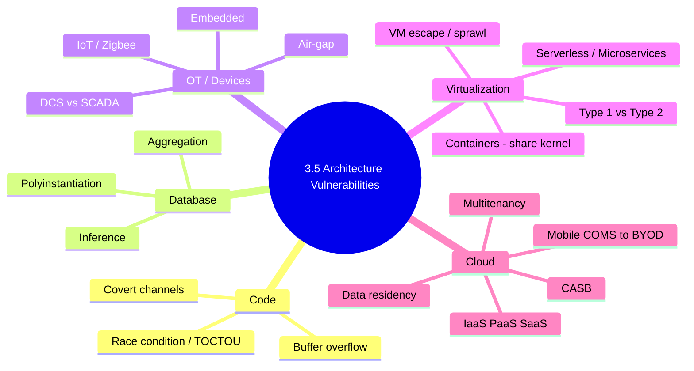
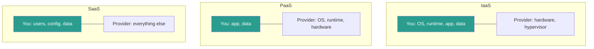
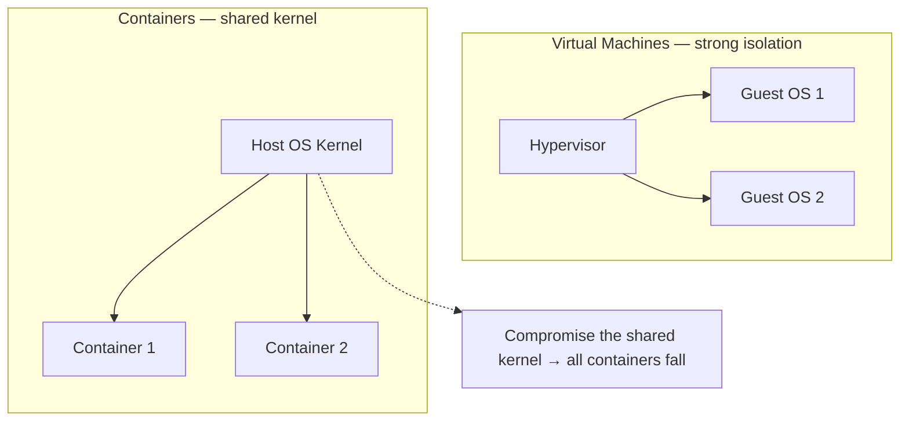

# Chapter 5 — Architecture Vulnerabilities (Sub-domain 3.5)

> **Official objective:** *Assess and mitigate the vulnerabilities of security architectures, designs and
> solution elements.*

This is the largest area of Domain 3. It spans five families of weakness: **code-level flaws**, **database
inference**, **ICS/SCADA & IoT**, **virtualization/containers/serverless**, and **cloud**.

---

## 1. Beginner Introduction

**What this topic is.** A catalogue of the *characteristic weaknesses* that come baked into each kind of
architecture — from a single program's memory handling, to a shared database, to an industrial plant, to a
global cloud. Knowing the weakness that *comes with* a design lets you mitigate it before an attacker finds it.

**Why it exists.** Every architecture makes trade-offs, and each trade-off opens a predictable class of holes.
Containers trade isolation for speed → the shared kernel is the risk. Cloud trades control for scale →
multitenancy is the risk. Naming these lets teams anticipate rather than react.

**Why CISSP includes it.** Because architects choose designs, and each choice imports a threat profile. The exam
tests whether you can pair an architecture with its signature vulnerability and its correct mitigation.

**Why security professionals should understand it.** These are the weaknesses you will actually defend in
production: race conditions in code review, inference in databases, air-gaps for SCADA, host hardening for
containers, and shared-responsibility gaps in cloud.

---

## 2. Concept Explanation

### Code-level flaws

- **Race condition.** The outcome wrongly depends on the *timing* of concurrent access to a shared resource.
- **TOCTOU (Time-of-Check to Time-of-Use).** The most common race: the attacker swaps the resource in the tiny
  gap between the permission *check* and the *use* (e.g. replaces a checked file with a symlink to
  `/etc/shadow`). **Found by code review, not scanning** — this exact phrasing is on the exam.
- **Buffer overflow.** Software accepts more input than the buffer holds; the excess overwrites adjacent memory.
  Countermeasures: good coding, source-code scanners, developer education, **strongly-typed languages**, plus
  runtime defences (bounds enforcement, ASLR).
- **Covert channels.** Information moves in ways policy never intended. **Storage** channel = signal by
  modifying stored objects; **timing** channel = signal by modulating event timing. In complex systems you can
  only *minimise* them (covert-channel analysis at design time) — never fully eliminate.

### Database inference

- **Aggregation.** Combine many individually harmless records into a sensitive whole (unclassified logistics
  rows → full troop-movement picture).
- **Inference.** *Deduce* information beyond your clearance from what you can legitimately see (budget jumped the
  month a classified project started).
- **Polyinstantiation.** The classic defence — keep *multiple versions* of the same record at different
  classification levels so lower-cleared users see a plausible cover story, not a revealing gap.
- Also: **views** (restrict columns/rows), **content-/context-dependent access control**.

### ICS / SCADA / Embedded / IoT

- **ICS** run *physical* processes → priority flips to **availability & integrity before confidentiality**;
  attacks have physical-world effects.
- **DCS** (Distributed Control System) = state-driven **process control**, limited area (one plant).
- **SCADA** (Supervisory Control and Data Acquisition) = event-driven **data gathering/monitoring**, wide
  geographic area (a pipeline).
- **Patching is often impossible** (24/7, physically inaccessible) → **air-gapping** + segmentation + data
  diodes is the primary compensating control.
- **Embedded** = dedicated-function, low-power, long-life. **IoT** = weak auth, unpatchable firmware, default
  creds → isolate on separate segments. **Zigbee** = low-power, low-throughput, close-proximity IoT protocol;
  128-bit symmetric encryption.

### Virtualization / containers / serverless / microservices

- **Hypervisor Type 1** = bare-metal (runs on hardware; data-centre standard; small attack surface). **Type 2**
  = hosted (runs on a host OS; inherits its flaws; desktops/labs).
- **VM escape** = break out of a guest to the hypervisor → every guest falls. **VM sprawl** = VMs multiply
  beyond the team's ability to track/patch.
- **Containers** share the host OS **kernel** → the single most critical control is **hardening the host** (plus
  trusted, scanned images — compromised images/repos are the primary risk).
- **Serverless** = you write code, the CSP runs *all* infrastructure; event-driven, stateless. Attack surface
  shrinks but visibility drops; over-permissioned function roles and event injection are the new risks.
- **Microservices** = small, loosely-coupled services → many inter-service connections, each must be
  authenticated + encrypted. **Microservices ≠ containers** (a microservice can run without a container; a
  container can hold a monolith).

### Cloud

- **Service models:** IaaS (you manage OS-up), PaaS (apps-up), SaaS (users/data only).
- **Deployment models:** public, private, community, hybrid. SaaS-on-public = most cost saving, least overhead.
- **Multitenancy** = the greatest cloud security concern (your data on the same hardware as strangers').
- **Data residency** = crossing borders triggers the destination's jurisdiction; **encryption ≠ compliance** —
  a legal review comes first.
- **CASB** = sits between users and cloud; real-time policy enforcement, scans data at rest, exposes shadow IT.
- **Mobile fleet** (strongest→weakest): **COMS → COPE → CYOD → BYOD** (BYOD compensated with MDM + MFA).

---

## 3. Internal Working

A TOCTOU race, frame by frame:

```
Attacker's goal: get a privileged program to open a sensitive file it shouldn't
        │
        ▼
[Time of CHECK]  program: access("/tmp/report", …)  → "yes, you may use this path"
        │
        ▼   <<< the race window — microseconds >>>
Attacker swaps /tmp/report for a symlink → /etc/shadow
        │
        ▼
[Time of USE]  program: open("/tmp/report")  → actually opens /etc/shadow
        │
        ▼
Privileged program reads a file it never validated → secret exposed
```

Mitigation: shrink or eliminate the window — re-validate at the moment of use, use atomic operations, hold a
handle rather than re-resolving a name.

A container-host compromise:

```
Container A (vulnerable app)
        │  shares
        ▼
Host OS KERNEL  ◄── shared by ALL containers
        │  kernel exploit / privileged container escape
        ▼
Attacker gains host root ──► every container on the host is now exposed
```

That is *why* "secure the host kernel" is the answer, not "secure container A."

---

## 4. Real-World Example

**Company:** *Volta Energy*, a utility running a modern IT estate *and* a legacy grid-control network.

- **Grid control (ICS/SCADA):** the turbine controllers run 24/7 and cannot be patched. Volta **air-gaps** the
  SCADA network and uses a one-way data diode so telemetry flows out to IT but nothing flows back in. When an
  attacker compromises the corporate network, the diode stops them reaching the physical process — avoiding a
  valve-manipulation scenario with real-world consequences.
- **Billing app (code flaw):** a developer's file-handling routine has a **TOCTOU** bug. It's caught in **code
  review** (not the nightly vulnerability scan, which never sees it) and fixed by holding a file handle instead
  of re-resolving the path.
- **Customer analytics (database):** an analyst without clearance notices the "renewables" budget line jumped
  exactly when a secret project launched — **inference**. Volta applies **polyinstantiation** so lower-cleared
  users see a cover value.
- **Container platform:** a compromised web container tries to break out. Because Volta **hardened the host
  kernel** and runs only **signed, scanned images**, the escape fails. Meanwhile the ops team tackles **VM
  sprawl** — 40 forgotten, unpatched VMs — with an inventory sweep.
- **Cloud move:** before migrating EU meter data to a US cloud region, legal flags **data residency** —
  encryption alone won't satisfy GDPR, so a **legal review** reroutes the data to an EU region. A **CASB**
  surfaces that staff were using an unsanctioned file-sharing app (shadow IT).

---

## 5. Step-by-Step Walkthrough — Assessing an Architecture's Vulnerabilities

1. **Identify the architecture type** (monolith, database, ICS, VM, container, serverless, cloud).
2. **Recall its signature weakness** (race/overflow, inference, unpatchable + physical impact, shared kernel,
   over-permissioned roles, multitenancy).
3. **Match the detection method** — e.g. race conditions → *code review*, not scanning.
4. **Apply the named mitigation** (re-validate at use; polyinstantiation; air-gap; harden host; least-privilege
   function roles; legal review + tenancy isolation).
5. **Confirm the compensating control** where the root fix is impossible (air-gap for unpatchable ICS; MDM+MFA
   for BYOD).
6. **Document residual risk** and the shared-responsibility split.

---

## 6. Visual Learning

### The five vulnerability families



### Cloud shared-responsibility by model



### VM vs Container isolation



---

## 7. Memory Tricks

- **TOCTOU:** *"Checked the coat, someone swapped it before you wore it."* Time-of-Check ≠ Time-of-Use.
- **Aggregation vs inference:** **"Aggregate = Add up pieces; Infer = Imagine the gap."**
- **DCS vs SCADA:** **"DCS = Dense (one Site); SCADA = Spread (wide Area)."** DCS state-driven, SCADA
  event-driven, data-gathering.
- **Containers:** *"Roommates share one kitchen (kernel) — poison the kitchen, poison everyone."*
- **Mobile order:** **"COMS Cope, CYOD, BYOD"** — best to worst control, alphabetically almost descending in
  corporate ownership.
- **Multitenancy:** *"Same building, thin walls."*

---

## 8. Common Exam Traps

- **How are race conditions found?** → **code review** (never pen-test or vulnerability scan). Verbatim.
- **Aggregation vs inference.** "Put pieces together" = aggregation; "figured out something hidden" = inference;
  **polyinstantiation** is the fix for inference.
- **Container first control.** → **the host OS kernel** (shared), not the individual container.
- **DCS vs SCADA.** DCS = process, state-driven, one site; SCADA = data, event-driven, wide area.
- **Can't patch the PLCs.** → **air-gap / segment**, not "patch harder."
- **Encryption satisfies data residency?** → **No** — legal review first; encryption ≠ jurisdictional
  compliance.
- **Biggest public-cloud concern?** → **multitenancy**.
- **Microservices = containers?** → No; independent concepts.

---

## 9. Comparison Tables

### DCS vs SCADA

| | DCS | SCADA |
|---|---|---|
| Purpose | Process control | Data gathering / monitoring |
| Trigger | State-driven | Event-driven |
| Geography | Limited area (one plant) | Wide area (pipeline, grid) |
| Example | Refinery unit control | Utility telemetry network |

### VM vs Container

| | Virtual Machine | Container |
|---|---|---|
| Isolation | Own full OS (strong) | Shares host kernel (weaker) |
| Weight | Heavy | Light |
| Boot | Slow | Fast |
| Primary risk | VM escape, sprawl | Compromised image, kernel escape |
| First control | Harden hypervisor | Harden host kernel + trusted images |

### Aggregation vs Inference

| | Aggregation | Inference |
|---|---|---|
| Mechanism | Combine harmless data | Deduce hidden data |
| Verb | "Put together" | "Figure out" |
| Fix | Restrict combined access | Polyinstantiation, views |

---

## 10. Interview Perspective

- **Security Engineer:** writes secure code (avoids TOCTOU/overflows), hardens container hosts, sets
  least-privilege serverless roles.
- **Security Architect:** segments OT networks, chooses hypervisor type, designs multi-tenant isolation and
  cloud landing zones.
- **Cloud Engineer:** owns the customer side of shared responsibility, deploys CASB, enforces data-residency
  guardrails, manages IAM.
- **GRC Consultant / Auditor:** checks data-residency legal reviews, ICS patch-exception documentation, mobile
  policy (COMS→BYOD) and CASB coverage.
- **SOC Analyst:** hunts VM-escape / container-breakout indicators, detects shadow IT via CASB logs, watches
  ICS anomalies.

---

## 11. Standards & References

- **ISC² CISSP CBK** — Domain 3, architecture vulnerabilities.
- **CWE-367** (TOCTOU), **CWE-120** (buffer overflow) — MITRE.
- **OWASP** — Buffer Overflow; Serverless Top 10.
- **NIST SP 800-82 Rev. 3** — Guide to Operational Technology (OT) Security.
- **CISA** — Industrial Control Systems security guidance.
- **NIST SP 800-190** — Application Container Security Guide.
- **NIST SP 800-125** — Security for Full Virtualization Technologies.
- **NIST SP 800-145** — The NIST Definition of Cloud Computing.
- **Cloud Security Alliance** — Security Guidance / CCM.

---

## 12. Key Takeaways

- **TOCTOU** = swap between check and use; found by **code review**. Buffer overflows → strong typing + bounds +
  ASLR. Covert channels can only be minimised.
- **Aggregation** = combine; **inference** = deduce; **polyinstantiation** = the fix.
- **DCS** = process/state/one-site; **SCADA** = data/event/wide-area; **air-gap** unpatchable ICS.
- **Type 1** bare-metal vs **Type 2** hosted; containers **share the host kernel** (harden the host); watch **VM
  sprawl**; microservices ≠ containers.
- Cloud: **multitenancy** is the top concern; **data residency** needs a legal review (encryption ≠ compliance);
  **CASB** enforces policy and exposes shadow IT; mobile **COMS best → BYOD least**.
