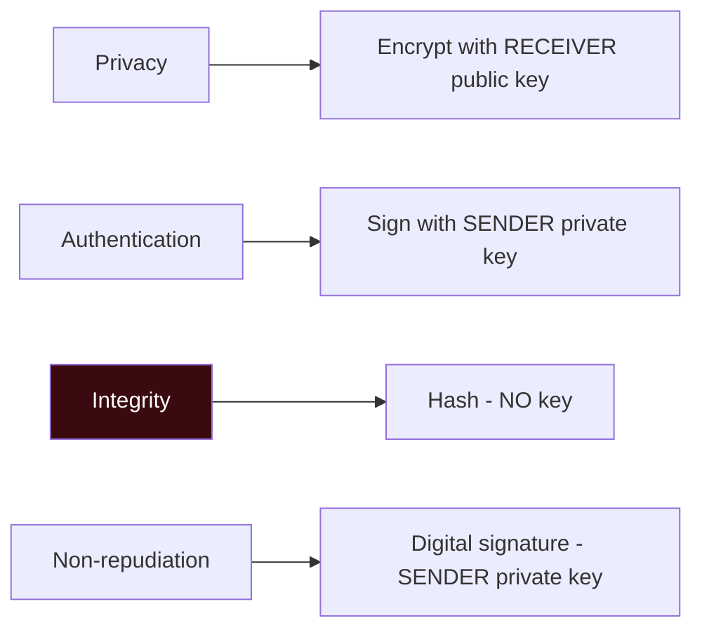
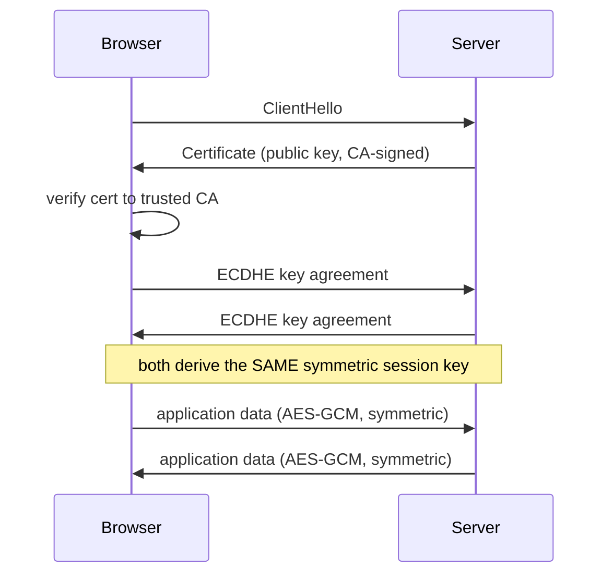
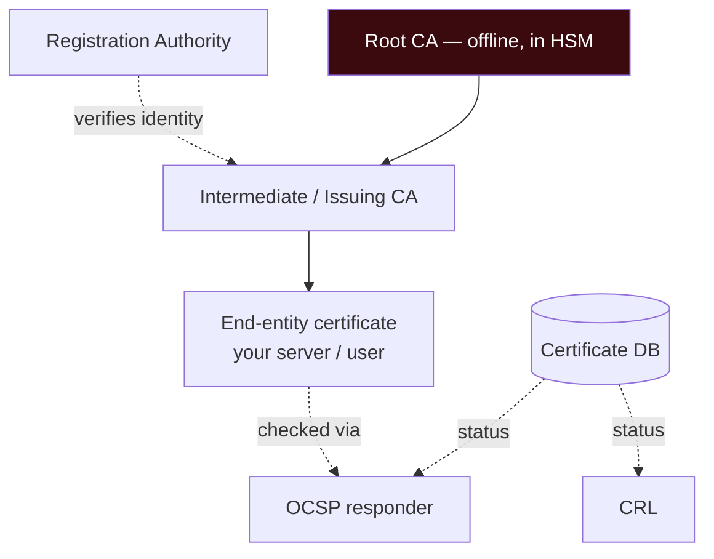
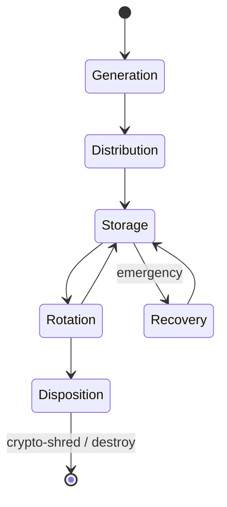

# Chapter 6 — Cryptography (Sub-domain 3.6)

> **Official objective:** *Select and determine cryptographic solutions.*

The most heavily weighted slice of Domain 3. Master five things: the **PAIN** goals, **symmetric**,
**asymmetric**, **hashing & signatures**, and **PKI / key management** — and always know *which key does what*.

---

## 1. Beginner Introduction

**What this topic is.** Cryptography is the mathematics of protecting information — keeping it secret, proving it
hasn't changed, proving who sent it, and stopping the sender denying they did. It is the toolbox behind HTTPS,
disk encryption, digital signatures and secure messaging.

**Why it exists.** We constantly send data across channels we don't control (the internet, radio, shared cloud
hardware). Cryptography lets two parties communicate securely *even when everyone in between is hostile* — the
only way to do that at scale.

**Why CISSP includes it.** Because choosing the *right* cryptographic solution for a goal is an architect's
job, and because the exam loves the precise mappings: which key encrypts, which key signs, what provides
integrity. Get the mapping wrong on the job and you build something that looks encrypted but proves nothing.

**Why security professionals should understand it.** Every secure system leans on crypto. You must know what
each primitive *does and does not* provide — especially the trap that integrity comes from *hashing*, never
from encryption.

---

## 2. Concept Explanation

### The PAIN goals

Crypto delivers four security goals; the mnemonic is **PAIN**:

| Goal | Delivered by | Key used |
|------|--------------|----------|
| **P**rivacy (confidentiality) | Encryption | **Receiver's public** key |
| **A**uthentication | Signing | **Sender's private** key |
| **I**ntegrity | **Hashing** (never encryption) | *no key* |
| **N**on-repudiation | Digital signature (hash + sign) | **Sender's private** key |

> [!IMPORTANT]
> Only **asymmetric** mechanisms give **non-repudiation** — a shared symmetric key can never prove *which*
> holder acted.

### Core vocabulary

- **Kerckhoffs' principle** — the system stays secure with everything public *except the key*.
- **Work factor** — the cost/time to break the crypto; must exceed the data's useful life. Each added key bit
  *doubles* it.
- **IV / nonce** — a random/unique starting value so identical plaintexts encrypt differently; **nonce reuse is
  catastrophic**.
- **Confusion** (substitution — hides the key↔ciphertext relationship) and **diffusion** (permutation — spreads
  each plaintext bit's influence). Their visible result is the **avalanche effect** (flip one input bit → ~half
  the output flips).
- **Key clustering** — two different keys producing the same ciphertext (an algorithm weakness).

### Symmetric cryptography

- **One shared secret key** for encrypt and decrypt. Fast; ideal for bulk data.
- **The key-count problem:** every pair needs its own key → **n(n−1)/2** keys (10 users = 45). Keys must travel
  **out-of-band**.
- **Stream ciphers** XOR a keystream bit-by-bit (RC4 — now prohibited). **Block ciphers** process fixed blocks
  (most algorithms).
- **Roster:** DES (broken, 56-bit) → 3DES (retired stopgap) → **AES/Rijndael** (the standard: 128-bit blocks;
  128/192/256-bit keys). Recognition names: Blowfish/Twofish, CAST-128, SAFER (Bluetooth), RC5/RC6.
- **Modes** (how blocks chain): **ECB** (patterns survive — never use), **CBC** (chains + IV), **CFB/OFB**
  (stream-like), **CTR** (counter → keystream; parallel; + auth = **GCM**).

### Asymmetric cryptography

- **A linked key pair** — public shared freely, private kept secret.
- **RSA** — security from factoring two large primes (2048-bit floor); slow → wraps session keys.
- **ECC** — highest strength per bit (256-bit ECC ≈ 3072-bit RSA); ideal for mobile/IoT/smart cards.
- **Diffie-Hellman** — **key exchange only**; two parties derive a shared secret over an open channel; **MITM if
  unauthenticated**.
- **ElGamal** — extends DH's discrete-log maths to encryption + signatures (ciphertext doubles in size).
- **Hybrid** — the real world: asymmetric handshake + symmetric session (TLS).
- **Quantum:** Shor's algorithm breaks RSA/DH/ECC → NIST **post-quantum** standards (ML-KEM/ML-DSA, FIPS
  203-205). **QKD** = quantum *key exchange* only (does not encrypt messages).

### Hashing & digital signatures

- **Hash** — one-way, fixed-length digest, **no keys**, integrity only. MD5/SHA-1 broken; SHA-2 workhorse;
  SHA-3 the different-maths hedge.
- **Birthday attack** — finds two messages with the same digest (collisions at 2^(n/2)); defend with stronger
  algorithms + **salting** (unique random per user).
- **HMAC** — keyed hash: authenticity, but *not* non-repudiation.
- **Digital signature** — hash encrypted with the **sender's private key**; verified with the **sender's public
  key**. Gives authenticity + integrity + non-repudiation. (DSA/ECDSA sign only, never encrypt.)
- **Blockchain** — chained hashes across a distributed ledger → integrity, non-repudiation, tamper-resistance.

### PKI & key management

- **CA** signs certificates (trusted root). **RA** verifies identity, never signs. Intermediates do daily
  issuing so the offline root stays safe.
- **CRL** = periodic revocation list (stale between updates). **OCSP** = real-time query. **OCSP stapling** =
  server pre-fetches the signed response and attaches it (cuts latency + CA load). **Pinning** = hard-code the
  expected cert/key.
- **Key lifecycle:** generation → distribution → storage (TPM/HSM) → rotation → disposition (crypto-shred) →
  recovery.
- **Split knowledge** (no one holds the whole key) vs **dual control** (two people must act together) vs **key
  escrow** (trusted third party holds copies for recovery).

---

## 3. Internal Working

### Hybrid encryption (how HTTPS actually protects a page)

```
Browser                                   Server
   │  1. "let's talk securely"               │
   │ ───────────────────────────────────────►│
   │  2. sends certificate (server's PUBLIC key, signed by a CA)
   │ ◄───────────────────────────────────────│
   │  3. verify cert chains to a trusted CA   │
   │  4. key agreement (ECDHE) → both derive the SAME symmetric session key
   │ ◄──────────────────────────────────────►│
   │  5. bulk data encrypted with fast SYMMETRIC AES-GCM
   │ ◄══════════════════════════════════════►│
```

Asymmetric solves *key distribution* (steps 2–4); symmetric does the *heavy lifting* (step 5). That is the
whole reason both exist.

### Digital signature — sign private, verify public

```
SENDER                                         RECEIVER
message ──► hash() ──► digest                  receives message + signature
                          │                            │
                          ▼                            ▼
        encrypt digest with SENDER's PRIVATE key   decrypt signature with SENDER's PUBLIC key → digest#1
                          │                            │
                          ▼                       re-hash the received message → digest#2
                    = SIGNATURE ──────────────►        │
                                                 compare digest#1 vs digest#2
                                                   match → authentic + intact + undeniable
```

---

## 4. Real-World Example

**Company:** *Corvus Bank*, securing customer transfers and internal document signing.

- **Confidentiality (PAIN-P):** the mobile app encrypts a payment payload with **the server's public key**;
  only the server's private key can read it.
- **Signing (PAIN-A/N):** a manager approves a wire by **signing the transaction hash with her private key**.
  Anyone can verify with her public key, and she cannot later deny it (non-repudiation) — crucial for audit.
- **Integrity (PAIN-I):** downloaded statements are checked against a published **SHA-256** hash; a single
  altered byte changes the digest.
- **Symmetric at scale:** the actual TLS session uses **AES-256-GCM** (fast bulk crypto) after an **ECDHE**
  handshake — hybrid crypto.
- **PKI:** the bank runs an **offline root CA** in an **HSM**; **intermediate CAs** issue daily certs; browsers
  check revocation via **OCSP stapling**.
- **Key management:** the root key is under **split knowledge + dual control** — three officers each hold a
  share, and two must act together to use it.
- **Attacker:** an attacker on public Wi-Fi attempts a **MITM** on an unauthenticated key exchange — defeated
  because the certificate **authenticates** the server's DH parameters. Another tries **rainbow tables** on a
  stolen password file — defeated because every hash was **salted**.

---

## 5. Step-by-Step Walkthrough — "Which Crypto Do I Use?"

1. **State the goal in PAIN terms.** Secrecy? Proof of sender? Proof of no change? Undeniability?
2. **Confidentiality → encrypt.** To *someone*, use *their public key*; for bulk data, use a *symmetric* session
   key exchanged via asymmetric/DH (hybrid).
3. **Integrity → hash.** No keys. Compare digests.
4. **Authentication / non-repudiation → digital signature.** Hash, then sign with *your private key*; others
   verify with *your public key*.
5. **Key exchange over an open channel → Diffie-Hellman**, but authenticate it (certificates) to stop MITM.
6. **Constrained device → ECC** (small keys). **Bulk speed → AES**. **Legacy to replace → move DES/3DES/RC4 to
   AES**.
7. **Distribute trust → PKI** (CA signs, RA verifies); **check revocation** with OCSP (+ stapling).
8. **Protect keys → TPM/HSM**, rotate, and use **split knowledge + dual control** for the crown jewels.

---

## 6. Visual Learning

### PAIN → mechanism → key



### Symmetric vs Asymmetric roles in TLS



### PKI chain of trust



### Key lifecycle



---

## 7. Memory Tricks

- **PAIN:** the four crypto goals — **P**rivacy, **A**uthentication, **I**ntegrity, **N**on-repudiation.
- **Key directions:** *"Encrypt to you = your public. Prove it's me = my private."* Sign private, verify public.
- **Integrity trap:** *"Integrity is a Hash, not a lock."* No key involved.
- **Symmetric key count:** **n(n−1)/2** — *"everyone shakes hands with everyone."*
- **DH:** *"Diffie-Hellman agrees, it does not encrypt"* — and *"unauthenticated DH invites a Middle Man."*
- **ECC:** *"Small keys, mighty strength"* — for phones and chips.
- **Split knowledge vs dual control:** *"Split the SECRET vs split the ACTION."*
- **Certify roles:** *"RA Recognises you, CA Certifies you."*

---

## 8. Common Exam Traps

- **Integrity from encryption?** → **No — hashing.** ISC²'s single favourite trap.
- **Which key encrypts to a recipient?** → *their* **public** key (not yours, not private).
- **Sign vs verify keys.** Sign = **sender private**; verify = **sender public**. Reversed = wrong.
- **Non-repudiation from symmetric?** → **No** — only asymmetric; a shared key can't prove who acted.
- **DH provides encryption/confidentiality?** → **No** — key exchange only; needs authentication or it's
  MITM-able.
- **ECB for real data?** → **Never** (patterns survive — the "penguin").
- **Key count formula.** Symmetric **n(n−1)/2**; asymmetric **2n**. 10 users symmetric = 45.
- **CA vs RA.** CA **signs**; RA only **verifies identity**.
- **CRL vs OCSP.** CRL periodic (delay); OCSP real-time; stapling offloads the CA.
- **DSA encrypts?** → **No** — signature only.
- **QKD encrypts messages?** → **No** — key distribution only.

---

## 9. Comparison Tables

### Symmetric vs Asymmetric

| | Symmetric | Asymmetric |
|---|---|---|
| Keys | One shared secret | Public + private pair |
| Speed | Fast (bulk data) | ~1000× slower |
| Key count | n(n−1)/2 | 2n |
| Solves | Bulk encryption | Key distribution, signatures |
| Non-repudiation | No | Yes |
| Examples | AES, 3DES, RC4 | RSA, ECC, DH, ElGamal |

### Hashing vs Encryption

| | Hashing | Encryption |
|---|---|---|
| Direction | One-way (irreversible) | Two-way (reversible) |
| Keys | None | Yes |
| Goal | Integrity | Confidentiality |
| Output | Fixed-length digest | Ciphertext (size ~ input) |
| Example | SHA-256 | AES, RSA |

### CRL vs OCSP

| | CRL | OCSP |
|---|---|---|
| Method | Download blacklist | Real-time query |
| Freshness | Stale between updates | Current |
| Load | Client pulls big list | Per-cert query (stapling offloads CA) |

### Split Knowledge vs Dual Control

| | Split Knowledge | Dual Control |
|---|---|---|
| Divides | The **secret** (key parts) | The **action** (two must act) |
| Example | 3 officers each hold a key share | Two keys turned together to open the HSM |

---

## 10. Interview Perspective

- **Security Engineer:** implements TLS correctly (strong ciphers, no ECB/RC4), integrates HSM/KMS, sets up
  certificate issuance and rotation.
- **Security Architect:** designs the PKI hierarchy (offline root, intermediates), chooses algorithms
  (AES-GCM, ECDHE, SHA-256), plans post-quantum migration.
- **Cloud Engineer:** uses cloud KMS/HSM, envelope encryption, and crypto-shredding for tenant data destruction.
- **GRC / Auditor:** verifies key management (rotation, split knowledge, escrow), FIPS-validated modules, and
  that integrity controls actually use hashing/HMAC.
- **SOC Analyst:** spots weak/expired certs, revocation failures, and downgrade/MITM attempts in traffic.

---

## 11. Standards & References

- **ISC² CISSP CBK** — Domain 3, cryptography.
- **NIST FIPS 197** — AES. **FIPS 180-4** — Secure Hash Standard. **FIPS 186-5** — Digital Signature Standard.
- **NIST SP 800-38A/D** — block cipher modes (CBC…GCM). **SP 800-57** — Key Management. **SP 800-131A** —
  transitions (deprecating DES/3DES/RC4).
- **NIST Post-Quantum** — FIPS 203 (ML-KEM), 204 (ML-DSA), 205 (SLH-DSA).
- **RFC 5280** — X.509 PKI; **RFC 6960** — OCSP; **RFC 8446** — TLS 1.3.
- **NIST FIPS 140-3** — cryptographic module validation (TPM/HSM).

---

## 12. Key Takeaways

- **PAIN:** Privacy (encrypt with receiver's public), Authentication (sign with sender's private), Integrity
  (**hashing, no keys**), Non-repudiation (signature — asymmetric only).
- **Symmetric** = one key, fast, **n(n−1)/2**; **AES** is the standard, **DES/3DES/RC4** are dead. **ECB** never.
- **Asymmetric** = key pair; **RSA** (factoring), **ECC** (small keys), **DH** (key exchange only, MITM if
  unauthenticated); real systems are **hybrid**.
- **Hash** = one-way integrity; **signature** = hash signed with private key, verified with public; **salt**
  defeats rainbow tables.
- **PKI:** CA signs, RA verifies; **CRL** (delayed) vs **OCSP** (real-time, + stapling); protect keys in
  **TPM/HSM** with **split knowledge + dual control**.
- Quantum breaks RSA/DH/ECC → migrate to **post-quantum**; **QKD** distributes keys only.
