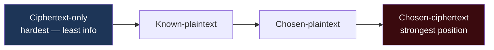
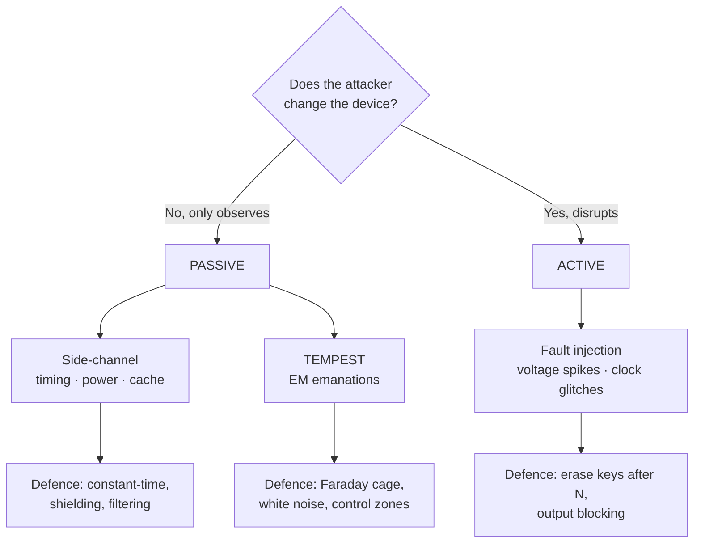

# Chapter 7 — Cryptanalytic Attacks (Sub-domain 3.7)

> **Official objective:** *Understand methods of cryptanalytic attacks.*

Crypto rarely falls to mathematics. It falls to *implementations, physics and people.* This chapter ranks the
classic attacks by attacker knowledge, then splits physical attacks into **passive** vs **active**.

---

## 1. Beginner Introduction

**What this topic is.** The catalogue of ways attackers break — or bypass — cryptography. Some target the
algorithm's maths; far more target *how the crypto is built and operated*: leaked timing, stolen hashes,
electromagnetic emissions, or a wrench applied to a person.

**Why it exists.** Defenders need to know how their protections fail so they can choose the right countermeasure.
"We used AES-256" means nothing if the key leaks through a power meter or sits in a temp file.

**Why CISSP includes it.** The exam tests two structured ideas: the **knowledge ladder** (attacks ranked by
what the attacker possesses) and the **passive vs active** split for physical attacks. Both are pure conceptual
frameworks you can memorise and apply.

**Why security professionals should understand it.** Because the real lesson is humbling and practical: strong
algorithms are rarely the weak link. Implementation, side channels and humans are — and that's where you spend
your defensive effort.

---

## 2. Concept Explanation

### The knowledge ladder (ranked by what the attacker HAS)

- **Ciphertext-only.** Attacker has *only* intercepted ciphertext. **Hardest** — least information.
- **Known-plaintext.** Attacker has plaintext *and* its matching ciphertext (Bletchley Park's "cribs").
- **Chosen-plaintext.** Attacker can get *chosen* inputs encrypted and observe the output.
- **Chosen-ciphertext.** Attacker can get *chosen ciphertexts decrypted* — the **strongest** position; needs
  access to the decryption system.
- **Linear & differential cryptanalysis** — academic block-cipher attacks. **Factoring** — targets RSA's
  modulus directly.
- **Brute force** — try every key; the single best defence is **increasing key length** (each bit doubles the
  work).

### Implementation-level attacks

- **Pass-the-Hash.** Steal an NTLM hash (e.g. via Mimikatz) and authenticate *with the hash itself* — no
  cracking needed. Lesson: protect hashes like passwords.
- **Replay.** Re-send captured packets. Killed by timestamps, nonces, sequence numbers.
- **Temporary files / swap / crash dumps.** Plaintext and keys leak here long after the "encrypted" work ended.
- **Ransomware.** Weaponises encryption *against you* — primarily an attack on **integrity/availability**.
- **Dictionary** (try likely words) and **rainbow tables** (precomputed hash chains) — the latter **completely
  neutralised by salting**.

### Physical attacks — the passive/active split

- **Side-channel (PASSIVE).** *Observe only* — timing variations, power consumption (SPA/DPA), cache access, EM
  emissions — to recover keys without touching the algorithm. Hard to detect (nothing is disturbed).
- **Fault injection (ACTIVE).** *Disrupt* the device — voltage spikes, clock glitches — to force exploitable
  errors. Countered by shielding, output blocking, and **erasing keys after N failed attempts**.
- **TEMPEST / emanation eavesdropping.** Intercept EM emissions leaking from equipment (the van-Eck "read the
  screen from the parking lot" attack). Defences, strongest first: **Faraday cage** (fully absorbs EM), **white
  noise** (mask the real signal), **control zones** (restrict where signals can reach).
- **Social routes.** **Purchase-key** (bribe/buy the secret) and **rubber-hose** (coercion) — countered
  procedurally by split knowledge and dual control, because no algorithm resists a wrench.

> [!IMPORTANT]
> Examiner's litmus test: **if the attacker only watches, it's passive; if they change the device's behaviour,
> it's active.** Side-channel and TEMPEST = passive; fault injection = active.

---

## 3. Internal Working

A timing side-channel recovering a key, conceptually:

```
Attacker sends many inputs to the crypto device
        │
        ▼
Device performs key-dependent operations (e.g. a branch or table lookup that depends on secret bits)
        │
        ▼
Attacker MEASURES response time precisely (microseconds) — NOTHING is altered (passive)
        │
        ▼
Statistical correlation: "responses were slower when this key bit = 1"
        │
        ▼
Repeat per bit ──► reconstruct the key without ever breaking AES itself
```

Countermeasure: **constant-time implementations** (no data-dependent branches/lookups), plus power filtering and
shielding for the power/EM variants.

Pass-the-Hash, end to end:

```
Attacker compromises one host ──► dumps LSASS memory (Mimikatz) ──► obtains NTLM hash
        │
        ▼
Presents the HASH directly to another server's NTLM auth (challenge-response uses the hash, not the password)
        │
        ▼
Authenticated as the user everywhere that account reaches — no password ever cracked
```

---

## 4. Real-World Example

**Company:** *Sentinel Payments*, defending smart-card readers and its Windows estate.

- **Side-channel (passive):** a researcher measures a card's **power draw** during signing and extracts the key
  bit-by-bit — never altering the card. Sentinel deploys cards with **constant-time crypto and power
  filtering**.
- **Fault injection (active):** a lab attacker glitches a reader's **voltage** mid-computation to force a faulty
  signature that leaks key bits. Sentinel's newer readers **erase keys after N anomalies** and add tamper
  meshes.
- **TEMPEST:** in a high-security room, staff worry a van outside could read a monitor's **EM emissions**.
  Sentinel lines the room as a **Faraday cage**; a nearby lower-risk area uses **white noise + control zones**.
- **Pass-the-Hash (implementation):** an attacker who phished one laptop dumps an **NTLM hash** and moves
  laterally. Sentinel's SOC contains it with **credential isolation, LAPS and least privilege** — and notes the
  hash was never cracked.
- **Rainbow tables:** the attacker also steals a password database — useless, because every entry was
  **salted**.
- **Rubber-hose:** a threat model considers coercion of a key-holder; **split knowledge + dual control** mean no
  single coerced person can release the master key.

---

## 5. Step-by-Step Walkthrough — Classifying an Attack in an Exam Stem

1. **Does it touch the maths or the implementation?** Maths → cryptanalytic ladder; implementation/physics →
   the practical attacks.
2. **On the ladder, ask what the attacker HAS.** Only ciphertext = ciphertext-only (hardest). Chosen decryptions
   = chosen-ciphertext (strongest).
3. **Brute force?** → defence is **longer keys**.
4. **Physical: watching or disrupting?** Watching (timing/power/EM) = **passive** (side-channel / TEMPEST).
   Disrupting (voltage/clock) = **active** (fault injection).
5. **EM emanation specifically?** → **TEMPEST**; full block = **Faraday cage**.
6. **Credential-based?** Hash reused = **Pass-the-Hash**; precomputed hashes = **rainbow tables** (beaten by
   **salt**); resent packets = **replay** (beaten by **timestamps/nonces**).

---

## 6. Visual Learning

### The knowledge ladder (weakest → strongest attacker position)



### Passive vs Active physical attacks



---

## 7. Memory Tricks

- **Ladder:** *"Only the CIPHERTEXT is the hardest climb."* Ciphertext-only = least info = hardest.
- **Passive vs active:** *"Watch = passive; Whack = active."* Side-channel watches; fault injection whacks.
- **TEMPEST:** *"Reading the screen from the street"* — and the full fix is a **Faraday cage** (metal mesh).
- **Pass-the-Hash:** *"They wore your badge without forging your face"* — the hash is the badge.
- **Salt vs rainbow:** *"Salt melts the rainbow."*
- **Rubber-hose:** *"The $5 wrench beats $5M of cryptanalysis"* — defend with split knowledge/dual control.

---

## 8. Common Exam Traps

- **Hardest attack?** → **ciphertext-only** (least information), *not* the "most powerful" one.
- **Strongest attacker position?** → **chosen-ciphertext**.
- **Best brute-force defence?** → **increase key length** (not "a better algorithm").
- **Side-channel vs fault injection.** Observe = **passive** side-channel; disrupt = **active** fault injection.
  They describe measuring *time/power* (passive) and hope you say "fault injection."
- **TEMPEST full block?** → **Faraday cage** (white noise/control zones only *reduce*).
- **Rainbow table defence?** → **salting**.
- **Replay defence?** → **timestamps/nonces/sequence numbers**.
- **Pass-the-Hash needs the password?** → **No** — the hash *is* the credential.

---

## 9. Comparison Tables

### Attacks by knowledge

| Attack | Attacker has | Difficulty |
|--------|--------------|-----------|
| Ciphertext-only | Only ciphertext | Hardest |
| Known-plaintext | Plaintext + ciphertext pairs | Easier |
| Chosen-plaintext | Chosen inputs encrypted | Easier still |
| Chosen-ciphertext | Chosen ciphertexts decrypted | Strongest position |

### Side-channel vs Fault injection vs TEMPEST

| | Side-channel | Fault injection | TEMPEST |
|---|---|---|---|
| Type | Passive | Active | Passive |
| Method | Observe timing/power/EM | Voltage/clock glitches | Intercept EM emanations |
| Detectable? | Hard (nothing disturbed) | Easier (device disrupted) | Hard |
| Defence | Constant-time, shielding | Erase keys after N, blocking | Faraday cage, white noise, zones |

---

## 10. Interview Perspective

- **Security Engineer:** writes constant-time crypto, enables credential isolation (LAPS, Credential Guard) to
  stop Pass-the-Hash, salts+peppers password hashes.
- **Security Architect:** specifies TEMPEST shielding / Faraday enclosures for sensitive facilities and
  tamper-responsive hardware for key handling.
- **SOC Analyst:** detects Pass-the-Hash and lateral movement (MITRE ATT&CK T1550.002), replay anomalies, and
  mass-authentication from dumped credentials.
- **GRC / Auditor:** verifies salting, key-erasure-after-N policies, split knowledge/dual control, and physical
  emanation controls in classified areas.
- **Cloud Engineer:** relies on provider side-channel mitigations (cache partitioning, confidential computing)
  and never stores keys in temp/logs.

---

## 11. Standards & References

- **ISC² CISSP CBK** — Domain 3, cryptanalytic attacks.
- **MITRE ATT&CK** — T1550.002 (Pass the Hash), T1110 (Brute Force), T1003 (Credential Dumping).
- **NSA/CSS TEMPEST** and **NSTISSAM TEMPEST/1-92** — emanation security (background).
- **NIST SP 800-57 / 800-63B** — key management; salting and password storage guidance.
- **FIPS 140-3** — physical security levels for crypto modules (tamper response, zeroization).
- **Kocher et al.** — timing and differential power analysis (foundational research).

---

## 12. Key Takeaways

- Rank cryptanalytic attacks by attacker knowledge: **ciphertext-only (hardest)** → known → chosen-plaintext →
  **chosen-ciphertext (strongest)**.
- **Brute force** defence = **longer keys**.
- Physical split: **watch = passive** (side-channel, TEMPEST); **disrupt = active** (fault injection).
- **TEMPEST** steals EM emanations; the full block is a **Faraday cage**.
- **Pass-the-Hash** authenticates with a stolen hash (no cracking); protect hashes like passwords.
- **Salting** neutralises **rainbow tables**; **timestamps/nonces** neutralise **replay**.
- Human attacks (purchase-key, rubber-hose) are beaten procedurally by **split knowledge + dual control**.
