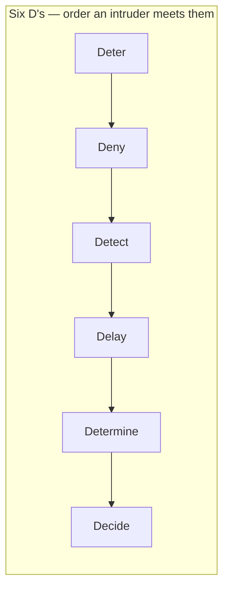
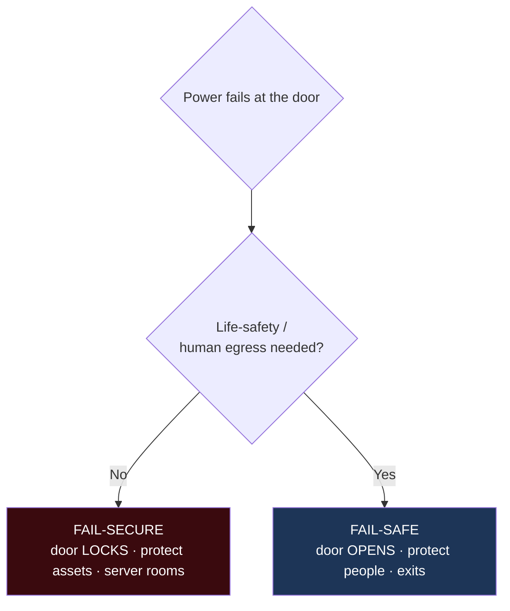
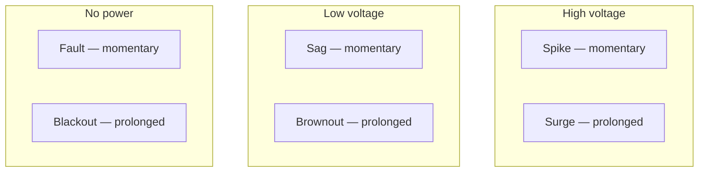
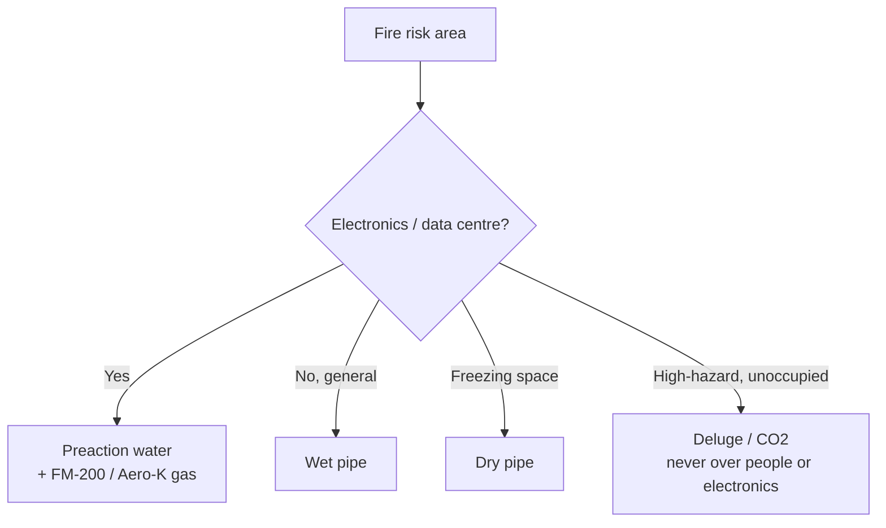

# Chapter 8 — Physical Security (Sub-domains 3.8 & 3.9)

> **Official objectives:** *3.8 Apply security principles to site and facility design.* *3.9 Design site and
> facility security controls.*

Physical security begins on the architect's drawing board. It shapes behaviour with **CPTED**, hardens what
remains, and sequences controls in the order an intruder meets them — all governed by one rule: **life safety
first.**

---

## 1. Beginner Introduction

**What this topic is.** Protecting the *physical* world around information: the site, the building, the server
room, and the people. It covers designing crime out of a space, controlling who gets through a door, keeping the
power and climate stable, and detecting and fighting fire.

**Why it exists.** Physical access usually *defeats* logical controls. Someone at the console can pull drives,
reset credentials or plant a device — no firewall helps. So the physical layer is foundational, not optional.

**Why CISSP includes it.** Because a security architect must design facilities as deliberately as networks — and
because the exam has a large bank of very specific, memorisable facts here (fence heights, humidity ranges, fire
suppression choices) that are easy marks if you learn them.

**Why security professionals should understand it.** Because data centres, offices and SCIFs are real assets you
will help design or audit, and because the golden rule — **people over property** — decides door failure modes,
suppression agents and evacuation every time.

---

## 2. Concept Explanation

### CPTED vs Target Hardening

- **CPTED (Crime Prevention Through Environmental Design)** — reduce crime by shaping how people *feel and
  behave*. Legitimate users feel ownership; intruders feel exposed. It is **psychological/behavioural**.
  - **Natural Access Control** — physical elements guide/restrict entry-exit paths (hedges funnelling visitors
    past reception).
  - **Natural Surveillance** — maximise visibility (low landscaping, open sightlines, windows on walkways) so
    intruders feel watched.
  - **Territorial Reinforcement** — clear boundaries create ownership (signage, pavement changes, fences that
    say "this is ours").
- **Target Hardening** — the contrast: **physical barriers that simply DENY** access (bollards, reinforced
  doors, grilles). A strong programme **layers both**.

### The Six D's (order of operations)

**Deter → Deny → Detect → Delay → Determine → Decide.** Discourage the attempt, block it, sense it, slow it,
assess what it is, then choose the response. Strict order — the exam tests the sequence.

### Server rooms & SCIFs

- **Core of the building**, **no windows**, **one exclusive controlled entrance** (single entry = best control;
  multiple entries exist only for emergency evacuation).
- **Positive pressurisation** — internal pressure higher than outside, so air flows *outward* when doors open,
  keeping dust/smoke/contaminants out.
- **SCIF** (Sensitive Compartmented Information Facility) — hardened, clearance-only, per-visit approval, TEMPEST
  shielding, no personal electronics.

### Perimeter & entry

- **Fence heights:** 3–4 ft deters casual trespassers; 6–7 ft deters most; **8+ ft with barbed/razor wire** for
  determined intruders.
- **Intrusion alarms:** **Deterrent** (makes the attempt harder), **Repellent** (sirens/lights drive them off),
  **Notification** (**silent** alert so responders act unseen).
- **Locks are delay controls** — every lock (combination, cipher, smart) can be picked/shimmed; they buy time.
- **Fail states:** **fail-secure** (locked on power loss — server rooms) vs **fail-safe** (opens — human
  egress).
- **Cards:** magnetic-stripe = trivially cloned; **smart cards** carry a chip and support MFA.
- **Entry abuse:** **tailgating** = follow through **without** consent; **piggybacking** = **with** consent. A
  **turnstile** only manages throughput; a **mantrap** (interlocked double doors, one person per cycle) is the
  strongest control against both.

### Power & environment

- **Six anomalies (3×2 grid):** high voltage — **spike** (momentary) / **surge** (prolonged); low voltage —
  **sag** (momentary) / **brownout** (prolonged); no power — **fault** (momentary) / **blackout** (prolonged).
- **Defence in layers:** surge protection + line conditioning (quality), **UPS** (bridge the gap), **generator**
  (duration; test under load).
- **Climate:** temperature **15–32 °C**; humidity **20–80%**. High humidity → corrosion; low humidity → static.
  Sensible cooling removes heat; latent cooling removes moisture.

### Fire

- **Golden rule: life safety over assets, always.**
- **Detection by stage:** **ionization** = incipient stage, *earliest* warning (before visible smoke);
  **photoelectric** = visible smoke (stage 2); heat detectors slowest but fewest false alarms.
- **Extinguisher classes:** **A** ordinary combustibles, **B** flammable liquids, **C** electrical, **D**
  combustible metals.
- **Water systems:** **wet pipe** (always charged — fastest, leak risk); **dry pipe** (air until triggered —
  freezing climates); **preaction** (two-stage — **best for data centres**, staff can abort a false alarm);
  **deluge** (all heads at once — never for electronics).
- **Gas:** **FM-200 / Aero-K** modern safe standards; **Halon banned** (ozone + health); **CO₂** effective but
  **lethal** — unoccupied spaces + pre-discharge alarms only.
- **HVAC shuts down automatically** in a fire (stops spreading smoke and feeding oxygen).

---

## 3. Internal Working

The Six D's as an intruder timeline:

```
Intruder approaches
        │
        ▼
DETER   — fence, lighting, signage → many give up here (cheapest win)
        │  (if undeterred)
        ▼
DENY    — locked gate/door physically blocks entry
        │  (if bypassed)
        ▼
DETECT  — PIR/glassbreak/camera senses the intrusion → starts the clock
        │
        ▼
DELAY   — additional locks/barriers slow them (must exceed response time)
        │
        ▼
DETERMINE — operators assess: real intrusion? which threat?
        │
        ▼
DECIDE  — dispatch guards / lockdown / police
```

The design constraint: **delay time must exceed response time**, or detection is pointless.

Positive pressurisation:

```
Server room pressure  >  corridor pressure
        │
        ▼
Door opens ──► air rushes OUT (not in)
        │
        ▼
Dust, smoke, contaminants are pushed away from equipment
```

---

## 4. Real-World Example

**Company:** *Atlas DataWorks*, designing a new data centre.

- **Site design (CPTED):** the architect uses **natural surveillance** (open sightlines, glass reception) and
  **natural access control** (landscaping funnels all visitors past a staffed desk), then **target hardening**
  (bollards, reinforced doors) for the loading dock.
- **Server room:** placed in the **building core**, **no windows**, **one** controlled entrance, **positive
  pressurisation**. A separate **SCIF** hosts a government client's classified workload.
- **Perimeter:** an **8-ft fence with razor wire** (determined-intruder rating), **silent notification alarms**,
  and a **mantrap** at the data-hall entrance to defeat **tailgating**.
- **Fail states:** the server-room doors are **fail-secure** (stay locked on power loss); the office egress
  doors are **fail-safe** (open — life safety).
- **Power:** UPS bridges outages while the **generator** (load-tested monthly) spins up; a logged **brownout**
  (prolonged low voltage) is ridden out without a reboot.
- **Fire:** **ionization** detectors give the earliest warning; a **preaction** sprinkler system means a single
  false alarm won't soak the servers; a **FM-200** gas system protects the tape vault; **HVAC auto-shuts** on
  fire.
- **Attacker/security team:** an intruder tailgates a contractor — the **mantrap** traps him between doors and
  the SOC dispatches guards (**Detect → Determine → Decide**). An auditor later flags an old **Halon** bottle
  for replacement with **FM-200**.

---

## 5. Step-by-Step Walkthrough — Designing Facility Controls

1. **Risk assessment** → critical path analysis → **site selection** (cost, location, size, neighbours).
2. **Facility design with CPTED** (natural access control, surveillance, territorial reinforcement).
3. **Layer target hardening** where deterrence isn't enough.
4. **Sequence controls** by the Six D's; ensure **delay > response time**.
5. **Place the server room** in the core: single entry, no windows, positive pressurisation; SCIF if required.
6. **Choose fail states** per door (secure for assets, safe for people).
7. **Design power resilience:** conditioning + UPS + generator; plan for all six anomalies.
8. **Set climate:** 15–32 °C, 20–80% humidity, dedicated monitored HVAC.
9. **Design fire response:** earliest detection (ionization), data-centre-appropriate suppression (preaction /
   FM-200), auto-HVAC shutdown — always life-safety first.

---

## 6. Visual Learning

### Physical security layers & the Six D's



### Fail-secure vs fail-safe



### Power anomaly grid



### Fire suppression decision



---

## 7. Memory Tricks

- **Six D's:** *"**D**on't **D**are **D**isturb **D**an's **D**inner **D**ecision"* — Deter, Deny, Detect,
  Delay, Determine, Decide.
- **CPTED strategies:** **"A-S-T"** — **A**ccess control, **S**urveillance, **T**erritorial reinforcement.
- **Fail states:** *"People OPEN, property LOCKS."*
- **Tailgating vs piggybacking:** *"Piggybacking = permission."* Both start with P.
- **Fences:** *"3-4 casual, 6-7 climbers, 8+ crazies."*
- **Fire detectors:** *"**I**onization is **I**mmediate (earliest); photoelectric = you can see the smoke."*
- **Preaction:** *"Two triggers, no accidental soak"* — best for data centres.
- **Humidity:** *"Too dry = spark; too wet = rust."*

---

## 8. Common Exam Traps

- **CPTED vs target hardening.** CPTED shapes *behaviour* (psychological); target hardening *denies* (physical).
- **Which CPTED strategy?** Open sightlines → **surveillance**; funnelled paths → **access control**; boundary
  markers → **territorial reinforcement**.
- **Fail-secure vs fail-safe.** No life-safety need → **fail-secure** (locked). People could be trapped →
  **fail-safe** (open).
- **Tailgating vs piggybacking.** Decided by one word: **consent** (piggybacking = with consent).
- **Turnstile vs mantrap.** Strongest against tailgating/piggybacking = **mantrap** (never turnstile).
- **Server-room design.** Core, single entry, **no windows**, positive pressurisation. Windows + multiple
  entrances = wrong.
- **Power terms.** Prolonged low voltage = **brownout**; momentary = **sag**; prolonged high = **surge**.
- **Fire detector earliest?** → **ionization** (incipient stage).
- **Data-centre sprinkler?** → **preaction**. **Never deluge** over electronics.
- **Replace Halon with?** → **FM-200 / Aero-K**.
- **Life safety vs assets.** Always **people first**.

---

## 9. Comparison Tables

### CPTED vs Target Hardening

| | CPTED | Target Hardening |
|---|---|---|
| Approach | Behavioural / psychological | Physical / absolute |
| Method | Design shapes behaviour | Barriers deny access |
| Examples | Sightlines, landscaping, signage | Bollards, reinforced doors, grilles |

### Fire suppression systems

| System | How it works | Best for |
|--------|--------------|----------|
| Wet pipe | Always charged with water | General occupancy |
| Dry pipe | Air until triggered | Freezing climates |
| Preaction | Two-stage (detect, then head melts) | **Data centres** |
| Deluge | All heads open | High-hazard, unoccupied |
| Gas (FM-200/Aero-K) | Interrupts/starves fire, no water | Electronics, vaults |

### Detectors

| Detector | Stage | Note |
|----------|-------|------|
| Ionization | Incipient (earliest) | Before visible smoke |
| Photoelectric | Visible smoke (stage 2) | Good for smouldering fires |
| Heat | Late | Fewest false alarms |

---

## 10. Interview Perspective

- **Security Architect:** designs data-centre placement, CPTED site plans, SCIF requirements, and fire/power
  resilience.
- **Security Engineer / Facilities:** implements access control (mantraps, smart cards), fail-state wiring, UPS
  and generator testing.
- **GRC / Auditor:** verifies fence/lighting standards, fail-state correctness, fire suppression suitability,
  Halon replacement, and environmental monitoring against policy.
- **SOC / Physical Security Operations:** monitors intrusion alarms and cameras (Detect → Determine → Decide),
  responds to tailgating and environmental alerts.
- **Cloud Engineer:** inherits most physical controls from the provider (reads the SOC 2 / ISO 27001 physical
  controls) but still owns endpoint and edge-site physical security.

---

## 11. Standards & References

- **ISC² CISSP CBK** — Domain 3, site and facility security.
- **NFPA 75 / 76** — fire protection of IT equipment and telecom facilities; **NFPA 72** — fire alarm code.
- **NIST SP 800-116** — physical access control (PIV). **NIST SP 800-88** — media handling (disposal overlap).
- **ASHRAE TC 9.9** — data-centre temperature and humidity guidance.
- **ICD 705** — SCIF construction standards (US).
- **International CPTED Association** — CPTED principles.
- **UL / ANSI** — lock and safe ratings.

---

## 12. Key Takeaways

- **Life safety first** — it decides every fail-state, suppression and evacuation question.
- **CPTED** (Access control, Surveillance, Territorial) shapes behaviour; **target hardening** denies access;
  layer both.
- **Six D's:** Deter → Deny → Detect → Delay → Determine → Decide; **delay must exceed response time**.
- **Server rooms:** core, single entry, no windows, positive pressurisation; SCIF for classified.
- **Fences** 3-4/6-7/8+; alarms Deterrent/Repellent/Notification; **mantrap** beats tailgating/piggybacking
  (consent = piggybacking).
- **Fail-secure** = locked (assets); **fail-safe** = open (people).
- **Power grid:** spike/surge, sag/brownout, fault/blackout; UPS bridges, generator sustains.
- **Climate:** 15-32 °C, 20-80% humidity.
- **Fire:** ionization = earliest; **preaction** for data centres; **FM-200/Aero-K** replace banned Halon; HVAC
  auto-shuts.
