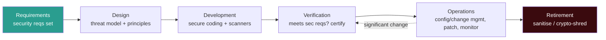
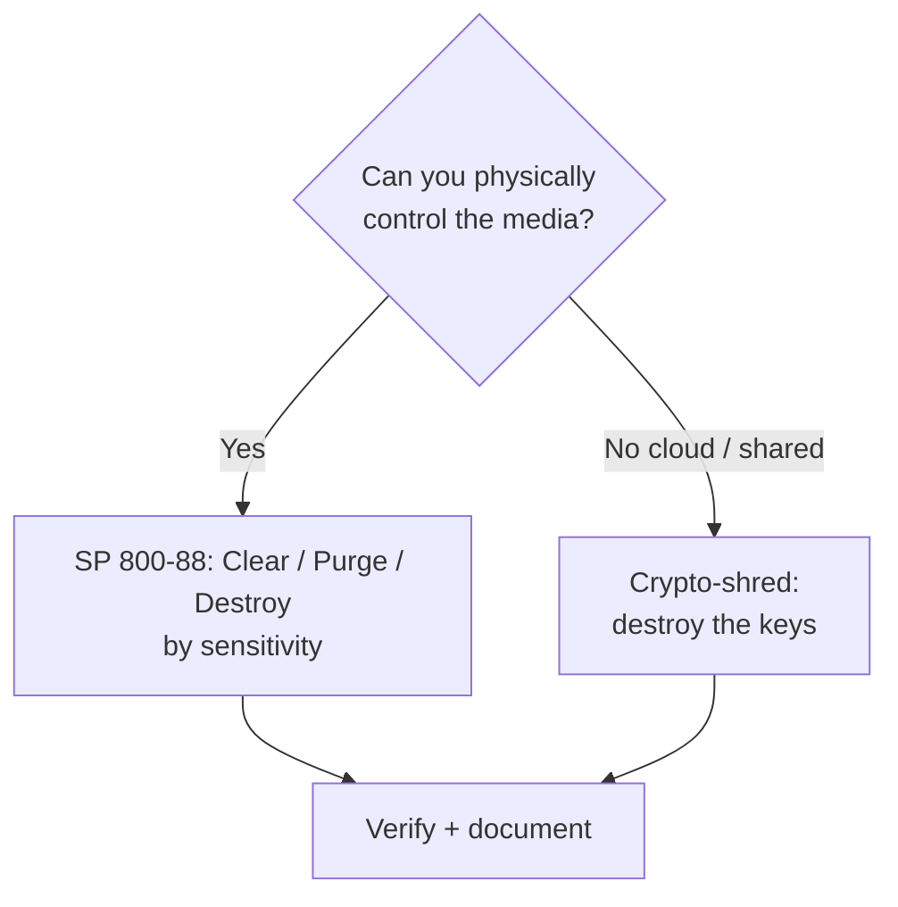

# Chapter 9 — Managing the Information System Lifecycle (Sub-domain 3.10)

> **Official objective:** *Manage the information system lifecycle.*

Security is a property of the *whole* lifecycle — from the first requirement to the last wiped disk. Bolting it
on later is the most expensive mistake in engineering.

---

## 1. Beginner Introduction

**What this topic is.** The idea that a system has a *life* — it is conceived, designed, built, run, and
eventually retired — and that security must be present at *every* stage, not sprinkled on at the end.

**Why it exists.** Teams historically built systems first and "added security" just before launch. That is both
the most expensive time to fix flaws and the least effective. The lifecycle view forces security to the front,
where it is cheap and powerful.

**Why CISSP includes it.** Because an architect's job is not a one-time design; it is stewardship across the
system's life, including the unglamorous ends — secure operations and secure disposal. The exam rewards the
"earliest phase wins" instinct.

**Why security professionals should understand it.** Because real risk clusters at *transitions* (upgrades,
migrations, decommissioning) and at *disposal* (a "retired" system still holding live data is a breach waiting
to happen).

---

## 2. Concept Explanation

### The phases

1. **Stakeholder needs & requirements** — security requirements defined *alongside* functional ones.
2. **Architecture & design** — threat modeling, secure design principles (Ch. 1), evaluation criteria (Ch. 3).
3. **Development & implementation** — secure coding, testing, certification.
4. **Integration & verification** — does the built system actually meet the security requirements?
5. **Operations & maintenance** — configuration and change management, patching, continuous monitoring, and
   **re-accreditation on significant change**.
6. **Retirement / disposal** — sanitise media (NIST SP 800-88) or crypto-shred where you can't touch the media
   (cloud).

### Two lifecycle truths the exam rewards

- **Defects cost far more the later they're found** — the entire economic argument for *security by design*.
- **Systems are most vulnerable during transitions** — upgrades, migrations, decommissioning.

### Key supporting concepts

- **Configuration management** — a known-good, documented baseline; prevents drift.
- **Change management** — every change is requested, reviewed, tested, approved and logged (ties to
  re-accreditation).
- **Continuous monitoring** — ongoing assurance the controls still work (RMF step 7).
- **Secure disposal** — **clear / purge / destroy** (SP 800-88); **crypto-shredding** for cloud/immovable media.

> [!IMPORTANT]
> A retired system that still holds live data isn't retired — it's *abandoned*. Disposal is a security
> activity, not an afterthought.

---

## 3. Internal Working

Where security "lives" at each stage, and how a flaw's cost grows:

```
Requirements ─► Design ─► Development ─► Verification ─► Operations ─► Retirement
     │            │            │              │              │             │
  security     threat       secure          test          config &     sanitise /
  reqs set     model +      coding +        against       change mgmt,  crypto-shred
  early        principles   scanners        sec reqs      patching,     (SP 800-88)
                                                          monitoring
     │
     ▼
Cost to fix a defect:  $        $$          $$$            $$$$          $$$$$   (grows ~10× per phase)
```

The change-management loop during operations:

```
Change requested ─► reviewed (CAB) ─► tested ─► approved ─► implemented ─► logged
        │                                                                    │
        └──────────── if "significant" ──► re-accreditation (new ATO) ◄──────┘
```

---

## 4. Real-World Example

**Company:** *Lumen Health*, building and later retiring a patient-portal system.

- **Requirements:** the security team writes encryption, access-control and audit requirements *into the
  original spec* alongside features — not after.
- **Design:** they threat-model the portal (STRIDE), apply secure design principles, and target a
  Common-Criteria-evaluated database.
- **Development:** developers use secure coding and SAST scanners; the build is **certified** (technical
  evaluation).
- **Verification:** testers confirm the built system meets each security requirement before go-live; the
  Authorizing Official grants the **ATO** (accreditation).
- **Operations:** all changes go through a **change advisory board**; patches are tracked; monitoring runs
  continuously. A major re-platforming triggers **re-accreditation**.
- **Retirement:** when the portal is replaced, drives are **purged** per SP 800-88, and the cloud copies are
  **crypto-shredded** by destroying the KMS keys. **Attacker angle:** a decommissioned server left on the network
  with live PHI would have been an easy breach — the disposal process prevents it.
- **Transition risk:** the security team pays extra attention during the migration weekend, knowing transitions
  are the most vulnerable moment.

---

## 5. Step-by-Step Walkthrough — Securing the Lifecycle

1. **Capture security requirements** with the functional ones (earliest = cheapest).
2. **Threat model and apply design principles** during architecture.
3. **Build securely** — secure coding, code review, SAST/DAST, dependency scanning.
4. **Certify** — technical evaluation against requirements.
5. **Verify** the built system meets those requirements; obtain **accreditation (ATO)**.
6. **Operate under configuration + change management**; patch and monitor continuously.
7. **Re-accredit** whenever a significant change occurs.
8. **Guard transitions** (upgrades, migrations) as high-risk windows.
9. **Dispose securely** — clear/purge/destroy or crypto-shred; verify and document.

---

## 6. Visual Learning

### The secure lifecycle



### Cost of fixing a defect by phase

```mermaid
flowchart LR
    R[Requirements<br/>$] --> D[Design<br/>$$] --> Dev[Development<br/>$$$] --> T[Testing<br/>$$$$] --> P[Production<br/>$$$$$]
    style R fill:#2a9d8f,color:#fff
    style P fill:#3a0a0e,color:#fff
```

### Secure disposal decision



---

## 7. Memory Tricks

- **Earliest wins:** *"Fix it on paper, not in production."* Cost grows ~10× per phase.
- **Transitions:** *"The system is naked while it's changing clothes"* — upgrades/migrations are the risky
  moments.
- **Disposal:** *"Retired must be wiped, not just unplugged."*
- **Clear/Purge/Destroy:** *"CPD — Clean, Purge, Pulverise"* — increasing thoroughness by sensitivity.
- **Crypto-shred:** *"No key, no data"* — the cloud disposal answer.

---

## 8. Common Exam Traps

- **"Add a security review later" vs "at requirements."** The **earliest phase** answer is right — cheapest and
  most effective.
- **Security is a phase?** No — security is present at **every** phase.
- **Re-accreditation trigger.** **Significant change** (not only the calendar).
- **Disposal = delete?** No — **sanitise** (clear/purge/destroy) or **crypto-shred**; deletion leaves data
  recoverable.
- **Most vulnerable moment?** **Transitions** (migration/upgrade/decommission).
- **Cloud disposal.** You can't shred the provider's disks → **crypto-shred** (destroy the keys).

---

## 9. Comparison Table

| Phase | Security focus | Key artifact |
|-------|----------------|--------------|
| Requirements | Define security requirements | Security requirements doc |
| Design | Threat model, secure design principles | Architecture + trust boundaries |
| Development | Secure coding, scanning | Certified build |
| Verification | Meets requirements? | Accreditation / ATO |
| Operations | Config/change mgmt, patch, monitor | Change records, monitoring |
| Retirement | Sanitise / crypto-shred | Disposal certificate |

| Disposal method | When | Overlap |
|-----------------|------|---------|
| Clear | Low sensitivity, reuse internally | SP 800-88 |
| Purge | May leave the org | SP 800-88 |
| Destroy | End of life, high sensitivity | SP 800-88 |
| Crypto-shred | Cloud / immovable media | Destroy the keys |

---

## 10. Interview Perspective

- **Security Engineer:** integrates security into CI/CD (SAST/DAST, dependency scanning), automates baselines.
- **Security Architect:** ensures security requirements are captured at inception and that the design carries
  through to disposal.
- **GRC / Auditor:** owns the Assessment & Authorization (RMF) process, re-authorization triggers, and disposal
  evidence (certificates of sanitisation).
- **Cloud Engineer:** implements crypto-shredding, key rotation and secure decommissioning of cloud resources.
- **SOC Analyst:** flags forgotten, unpatched, end-of-life systems still on the network (the classic abandoned-
  asset breach).

---

## 11. Standards & References

- **ISC² CISSP CBK** — Domain 3, system lifecycle.
- **NIST SP 800-160 Vol. 1 Rev. 1** — Systems Security Engineering.
- **NIST SP 800-37 Rev. 2** — Risk Management Framework (authorization, continuous monitoring).
- **NIST SP 800-88 Rev. 1** — Guidelines for Media Sanitization.
- **NIST SP 800-64** (historical) — security in the SDLC.
- **ISO/IEC 15288** — systems and software engineering life-cycle processes.
- **ISO/IEC 27001** — Annex A operational and change-management controls.

---

## 12. Key Takeaways

- Security lives at **every** phase — requirements to disposal.
- **Earliest phase wins:** defects cost ~10× more per phase; security by design is the economic argument.
- Operations = **configuration + change management + patching + continuous monitoring**; re-accredit on
  **significant change**.
- **Transitions** (upgrade/migration/decommission) are the most vulnerable moments.
- Secure disposal = **clear/purge/destroy** (SP 800-88) or **crypto-shred** for cloud/immovable media.
- A retired system holding live data is **abandoned**, not retired.
